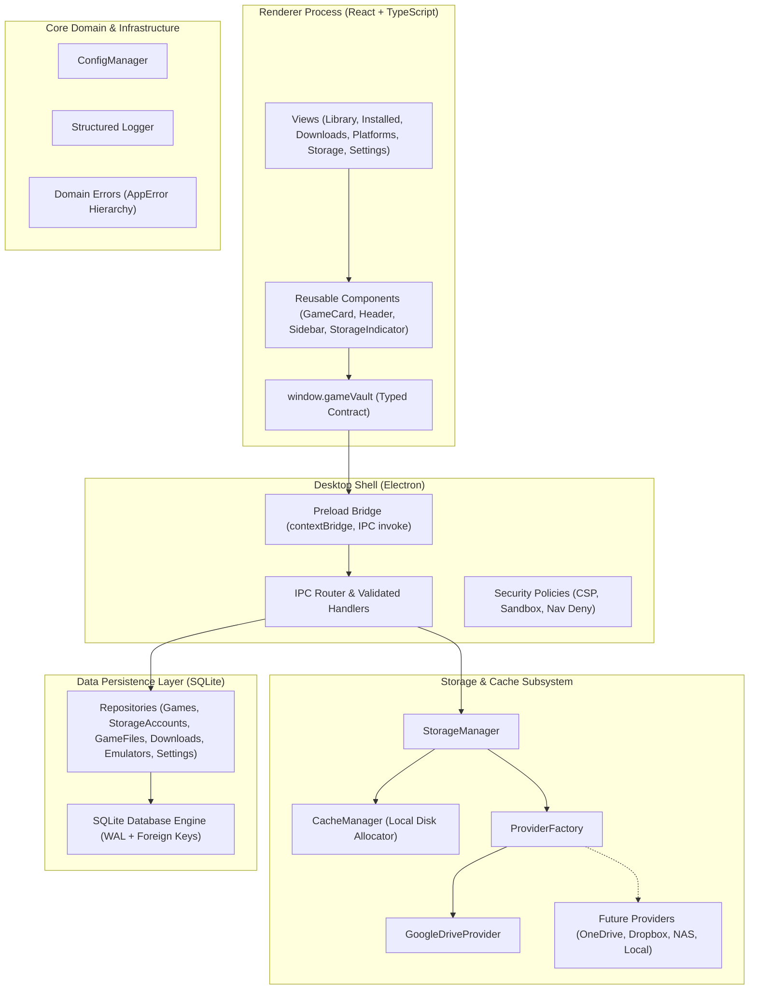
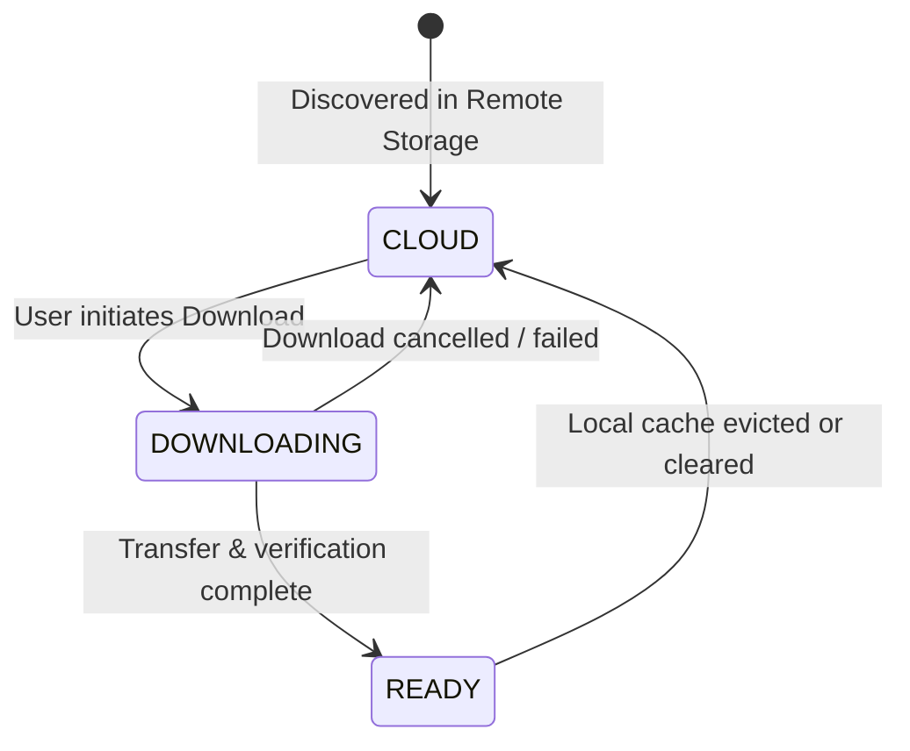
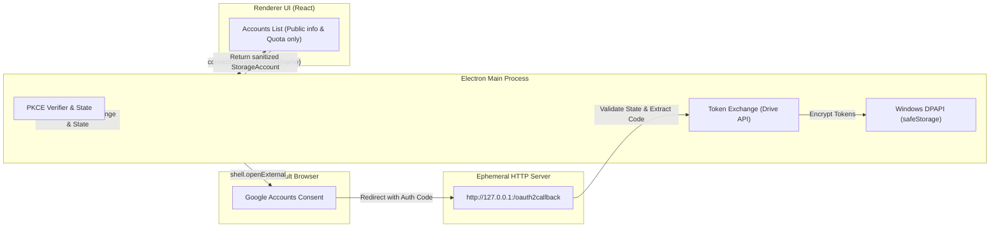
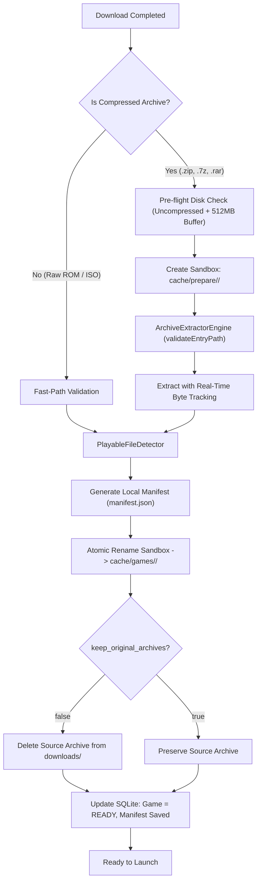
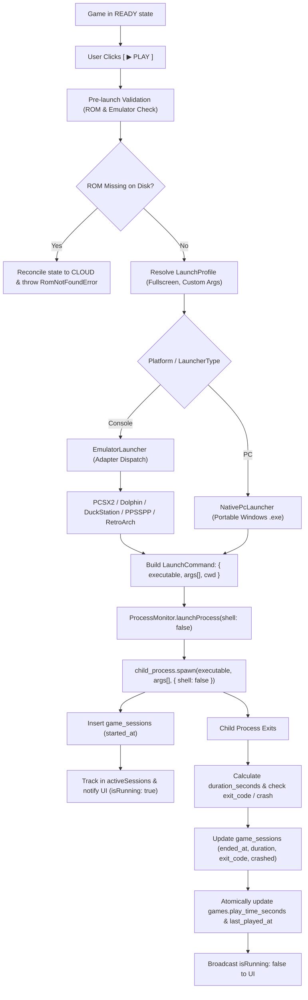
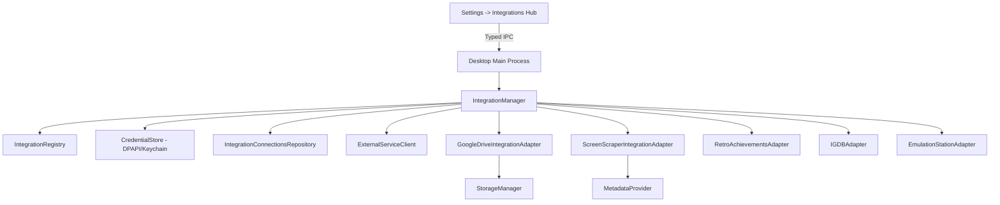
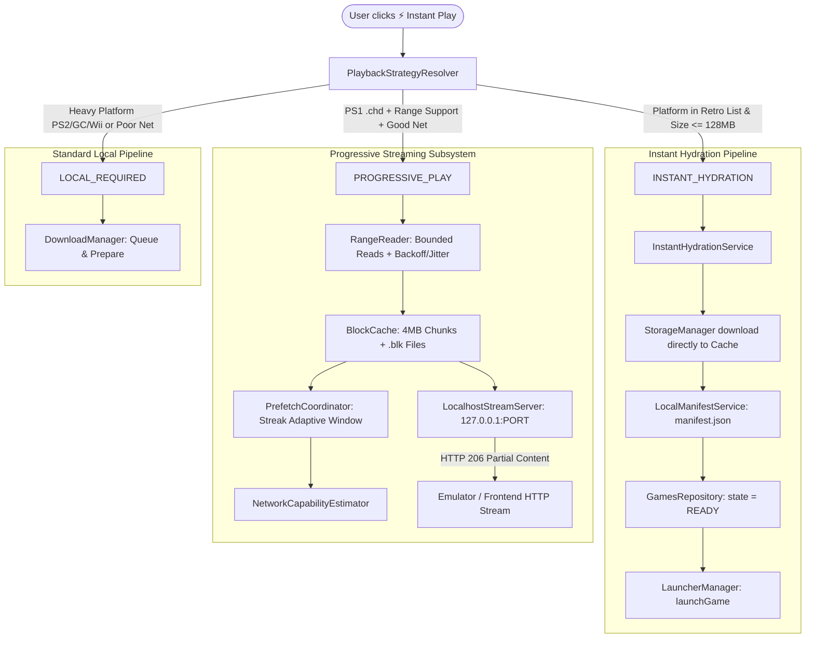

# GAME VAULT — Architecture Design Document

This document outlines the architectural blueprint, module boundaries, communication protocols, and data models of **Game Vault**.

---

## 1. High-Level Architectural Diagram



---

## 2. Directory Structure & Module Boundaries

The project enforces strict, unidirectional boundaries:

```
src/
├── desktop/         # Main & Preload Electron orchestrator
│   ├── main.ts          # Window initialization and lifecycle
│   ├── preload.ts       # contextBridge exposing window.gameVault
│   ├── security.ts      # WebPreferences, CSP headers, link interception
│   └── ipc/             # Strongly typed channels & main process handlers
│
├── ui/              # React Renderer Process
│   ├── components/      # Modular UI components (Header, Sidebar, GameCard, StorageIndicator, etc.)
│   ├── views/           # Views: Library, Installed, Downloads, Platforms, StorageScreen, Settings
│   ├── styles/          # Global styles, dark console theme, responsive CSS grid
│   └── types/           # Electron window typings
│
├── core/            # Domain Core
│   ├── types/           # Core domain models (Game, StorageAccount, GameFile, etc.)
│   ├── errors/          # AppError, DatabaseError, StorageError, ValidationError, etc.
│   ├── logger/          # Structured logger with redaction of sensitive credentials
│   └── config/          # OS-aware path resolution and configuration persistence
│
├── storage/         # Storage & Cache Management
│   ├── StorageManager.ts # Coordinates multi-provider quotas and sessions
│   └── CacheManager.ts   # Local game cache, space tracking, directory sanitation
│
├── providers/       # Storage Providers
│   ├── StorageProvider.ts # The foundational provider interface
│   ├── ProviderFactory.ts # Extensible registry for all storage backends
│   └── google-drive/    # Google Drive provider implementation
│
├── database/        # SQLite Persistence
│   ├── connection.ts    # better-sqlite3 singleton with WAL mode and foreign keys enabled
│   ├── schema.ts        # Idempotent DDL migrations for all 6 tables
│   └── repositories/    # Strongly typed CRUD repositories
│
├── downloads/       # Download Orchestration
│   └── DownloadManager.ts # Queue state machine and progress broadcasting
│
├── launchers/       # Native Game Launching
│   └── LauncherService.ts # Execution validation and process management
│
├── emulators/       # Retro/Console Emulation
│   └── EmulatorService.ts # Emulator registry and ROM dispatching
│
└── metadata/        # Game Metadata Enrichment
    └── MetadataService.ts # Future scraping contracts (IGDB, Steam storefront)
```

---

## 3. StorageProvider Abstraction & Multi-Account Architecture

To ensure Game Vault is never tightly coupled to a single storage provider, all remote backends implement the `StorageProvider` interface:

```typescript
export interface StorageProvider {
  readonly id: string;
  readonly name: string;
  readonly type: StorageProviderType;

  authenticate(credentials?: AuthCredentials): Promise<AuthResult>;
  disconnect(): Promise<void>;
  isConnected(): Promise<boolean>;
  getAccountInfo?(): Promise<{ email?: string; displayName?: string; picture?: string }>;
  listFiles(folderId?: string): Promise<RemoteFile[]>;
  getFile(fileId: string): Promise<RemoteFile>;
  download(
    fileId: string,
    destinationPath: string,
    onProgress?: (progress: DownloadProgress) => void
  ): Promise<DownloadResult>;
  getMetadata(fileId: string): Promise<FileMetadata>;
  getQuota(): Promise<StorageQuota>;
}
```

### Multi-Account Registry
Unlike typical desktop tools that support only one connected cloud account at a time, `StorageManager` maintains an internal `Map<string, StorageProvider>` keyed by account ID. This enables:
- Connecting multiple independent accounts of the same provider (e.g., "Ryan Principal 5 TB" and "Ryan Archive 5 TB").
- Independent authentication state, token refresh cycles, and isolated disconnect operations.
- Dynamic quota aggregation across all active connected accounts without cross-account contamination.

---

## 4. Game Lifecycle & State Machine

Every game in Game Vault transitions across three explicit states:



1. **`CLOUD`**: Game file exists exclusively on the user's remote storage. Metadata, cover art, and size are known and displayed.
2. **`DOWNLOADING`**: Game is actively transfering into the local SSD/HDD cache directory. Progress bar and speed are tracked.
3. **`READY`**: Game is verified, extracted, and present on local disk. Instant "Play" action is enabled.

---

## 5. SQLite Data Schema & Versioned Migrations

Game Vault uses an embedded SQLite database configured in **WAL (Write-Ahead Logging)** mode with active foreign key constraints and a versioned **MigrationRunner**:

### `schema_migrations`
Tracks applied schema migrations to guarantee non-destructive, idempotent database evolution.
- `version` (INTEGER PRIMARY KEY)
- `name` (TEXT)
- `applied_at` (TEXT)

### 1. `games`
Core catalog of indexed titles.
- Primary Key: `id` (UUID)
- Fields: `title`, `slug`, `description`, `cover_url`, `banner_url`, `platform`, `release_year`, `developer`, `publisher`, `state` (`CLOUD` | `DOWNLOADING` | `READY`), `size_bytes`, `installed_path`, `play_time_seconds`, `last_played_at`, `created_at`, `updated_at`.

### 2. `storage_accounts` (Updated in Migration 002)
Connected cloud and network storage accounts.
- Primary Key: `id`
- Fields: `provider_type`, `provider_account_id`, `account_name`, `account_email`, `credential_key`, `status` (`ACTIVE` | `DISCONNECTED` | `ERROR` | `REVOKED`), `quota_total_bytes`, `quota_used_bytes`, `last_synced_at`, `last_authenticated_at`, `created_at`, `updated_at`.
- Indices: `idx_storage_accounts_provider_acc` on `(provider_type, provider_account_id)`.

### 3. `game_files` (Updated in Migration 004)
Remote and local binary files associated with games.
- Primary Key: `id`
- Foreign Keys: `game_id` references `games(id)` ON DELETE CASCADE, `storage_account_id` references `storage_accounts(id)`.
- Fields: `remote_file_id`, `remote_path`, `filename`, `size_bytes`, `md5_checksum`, `status` (`CLOUD` | `DOWNLOADING` | `READY` | `CORRUPTED` | `MISSING`), `local_path`, timestamps.

### 4. `downloads`
Active and historical download queue.
- Primary Key: `id`
- Foreign Keys: `game_id` references `games(id)`, `game_file_id` references `game_files(id)`.
- Fields: `status` (`QUEUED` | `DOWNLOADING` | `PAUSED` | `COMPLETED` | `FAILED` | `CANCELLED`), `total_bytes`, `downloaded_bytes`, `download_speed_bps`, `error_message`, timestamps.

### 5. `emulators`
Configured console emulators.
- Primary Key: `id`
- Fields: `name`, `platform`, `executable_path`, `default_args`, `config_path`, `is_installed`, `version`, timestamps.

### 6. `settings`
Persistent application key-value configuration.
- Primary Key: `key`
- Fields: `value` (JSON serialized), `updated_at`.

### 7. `cloud_files` (Added in Migration 003)
Raw inventory of all discovered files in connected cloud accounts.
- Primary Key: `id` (UUID)
- Foreign Key: `storage_account_id` references `storage_accounts(id)` ON DELETE CASCADE.
- Fields: `remote_file_id`, `name`, `remote_path`, `parent_folder_id`, `size_bytes`, `mime_type`, `md5_checksum`, `is_folder`, `trashed`, `classification`, `confidence_score`, `metadata_json`, timestamps.
- Constraints: `UNIQUE(storage_account_id, remote_file_id)`.

### 8. `storage_sync_state` & `sync_runs` (Added in Migration 004)
Sync tokens and audit logging for initial and incremental synchronization.
- `storage_sync_state`: `storage_account_id`, `initial_scan_completed`, `start_page_token`, `next_change_page_token`, `last_full_scan_at`, `last_incremental_sync_at`, `last_error`, timestamps.
- `sync_runs`: `id`, `storage_account_id`, `started_at`, `finished_at`, `status`, `folders_scanned`, `files_scanned`, `games_detected`, `error_message`.

---

## 6. Security & Authentication Architecture

Game Vault adheres strictly to modern native application security standards:



1. **Native Loopback OAuth 2.0 (RFC 8252)**:
   - Uses an ephemeral local HTTP server bound strictly to `127.0.0.1`.
   - Authorization opens directly in the user's OS browser via `shell.openExternal`.
   - Never uses embedded WebViews, avoiding credential snooping or session hijacking.

2. **PKCE Enforcement (RFC 7636)**:
   - High-entropy cryptographically random `code_verifier` (256-bit).
   - SHA-256 base64url challenge (`S256`) sent to authorization server.
   - Mitigates authorization code injection attacks on desktop clients.

3. **OS-Level Credential Protection (DPAPI)**:
   - OAuth access tokens and refresh tokens are managed via `CredentialStore`.
   - Implemented using Windows DPAPI via Electron's `safeStorage.encryptString()` and `decryptString()`.
   - Fail-secure behavior: throws `CredentialStoreUnavailableError` if OS cryptography is unavailable without explicit override.
   - Credentials are **never** stored in SQLite and are **never** exposed to the renderer process.

4. **Least-Privilege Scopes**:
   - `drive.readonly` (Read-only access to files and metadata).
   - `userinfo.profile` (Display name and avatar).
   - `userinfo.email` (Account identification).
   - Game Vault has zero permission to delete or overwrite user cloud files.

5. **Strict Process Isolation**:
   - `contextIsolation: true`, `sandbox: true`, `nodeIntegration: false`.
   - CSP strictly configured in `src/desktop/security.ts`.
   - IPC channels validate input arguments before handling.

---

## 7. Cloud Inventory & Game Discovery Pipeline (Phase 2B)

See complete design documentation in [docs/CLOUD_SCANNING.md](docs/CLOUD_SCANNING.md).


Key capabilities:
- **Resilient Traversal**: BFS queue avoids call-stack overflow; handles pagination up to 1000 items/page; exponential backoff with jitter on 429/403/5xx errors.
- **Delta Sync**: Anchors `startPageToken` before initial scan and processes incremental changes via `listChanges(pageToken)`.
- **Heuristic Classification**: Discerns exclusive ROMs (0.95–0.99), contextual ambiguous files (`.iso`, `.exe`, `.zip`), and filtered non-game items (`.txt`, `.mp3`).
- **Grouping & Collisions**: Collapses multi-track BIN/CUE games into single entries; generates collision-proof slugs (`${slugify(title)}-${slugify(platform)}`).
- **Non-Destructive Deletion**: Trashed cloud files mark `game_files.status = 'MISSING'` while preserving user catalog metadata and play history.
<<<<<<< Updated upstream
=======

---

## 8. Sync Correctness & Consistency Gate (Phase 2C)

See complete documentation in [docs/SYNC_CORRECTNESS.md](docs/SYNC_CORRECTNESS.md).

Phase 2C addresses edge cases in real-world cloud synchronization:
- **CloudPathResolver**: Hierarchically reconstructs virtual paths for files in Google Drive Changes API (which omits path data) and executes atomic recursive subtree updates on folder renames/moves across `cloud_files` and `game_files`.
- **CloudChangeProcessor**: Centralized change ingestion separating folder subtree updates, file additions/reclassifications, and non-destructive trash marking.
- **Initial Scan Race Prevention**: Anchors pre-scan `startPageToken`, tracks generation via `last_seen_run_id`, reconciles unseen files only on 100% successful scan completion, and drains in-flight changes before advancing the page token.
- **Change Token Lifecycle & 410 Recovery**: Page tokens only advance upon successful processing; HTTP 410 Gone / expired tokens trigger safe, automatic full resync without data loss.
- **State Schema Consistency**: Strictly maintains separation between overall `GameState` (`CLOUD` | `DOWNLOADING` | `READY`) and individual `GameFileStatus` (`REMOTE` | `DOWNLOADING` | `CACHED_LOCAL` | `MISSING`).
- **Atomic Catalog Ingestion**: All candidate catalog writes execute within SQLite transactions, guaranteeing no orphaned records or partial ingestions on unexpected failures.

---

## 9. Reliable Download Engine V1 (Phase 3A)

See complete architectural documentation in [docs/DOWNLOAD_ENGINE.md](docs/DOWNLOAD_ENGINE.md).

Phase 3A provides the cloud-to-local bridge that brings games to playable state:
- **FIFO Queue & Single-Active Concurrency**: Eliminates concurrent download contention, bandwidth thrashing, and Google Drive API quota exhaustion.
- **Pre-Flight Disk Space Verification**: Enforces `file.sizeBytes + 512 MB` margin using `CacheManager.getAvailableDiskSpace()`, preventing disk exhaustion before byte zero is transferred.
- **HTTP Streaming with Backpressure**: Directly streams Google Drive `alt=media` HTTP responses into write streams without loading gigabyte payloads into RAM.
- **Path Traversal & Windows Device Name Defense**: `sanitizeFilename` removes path traversals, replaces illegal characters, prefixes reserved names (`CON`, `PRN`, `AUX`, `NUL`), strips trailing dots/spaces, and enforces subpath boundaries.
- **Streaming MD5 Integrity Verification**: Cryptographically validates file contents via streaming pipeline; removes corrupted `.part` files on checksum mismatches without touching destination directory.
- **Atomic Renaming**: Writes active downloads to `<cacheDir>/downloads/partial/<downloadId>.part` and atomically moves to `<cacheDir>/games/<gameId>/<filename>` upon validation.
- **Automated Crash Recovery**: On app launch, `recoverStaleDownloads` cleans orphan partial files and safely transitions interrupted `DOWNLOADING` records to `FAILED`.

---

## 10. Resumable Downloads & Multi-Download Control (Phase 3B)

See complete architectural documentation in [docs/DOWNLOAD_ENGINE.md](docs/DOWNLOAD_ENGINE.md).

Phase 3B transforms download handling from a single linear queue into a robust resumable transfer subsystem:
- **HTTP Range Resumption**: Requests byte ranges with `Range: bytes=X-`, verifying HTTP 206 Partial Content, while gracefully handling HTTP 416 completion and recovering from server resets.
- **Multi-Download Scheduler (`DownloadScheduler`)**: Dispatches downloads across configurable concurrent slots (1 to 4 concurrent downloads, default 2), prioritizing FIFO order while allowing manual priority promotion ("Download Next").
- **Exponential Backoff & Network Resilience**: Recovers from transient network drops with jittered backoff (1s, 2s, 4s, 8s, 16s) and respects HTTP 429 `Retry-After`.
- **Remote File Mutation Protection**: Cross-checks remote checksums and modified timestamps before resumption to prevent mixing byte streams from modified files.
- **Self-Healing Partial Files**: Identifies corrupted or oversized `.part` files larger than expected remote byte counts, safely truncating or restarting without application crashes.
- **Centralized Availability Engine (`GameAvailabilityService`)**: Reconciles game states dynamically across single and multi-file sets (BIN/CUE, multi-disc).

---

## 11. Install Preparation, Extraction & Smart Cache (Phase 3C)

See complete documentation in [docs/GAME_PREPARATION.md](docs/GAME_PREPARATION.md) and [docs/CACHE_MANAGEMENT.md](docs/CACHE_MANAGEMENT.md).

Phase 3C bridges the gap between raw downloaded files and ready-to-launch local games (`CLOUD` → `DOWNLOADING` → `PREPARING` → `READY`):



### Core Architecture Components:
1. **Universal Archive Extractor Engine (`ArchiveExtractorEngine`)**:
   - Delegates by file extension: `ZipExtractor` (`.zip` via adm-zip), `SevenZipExtractor` (`.7z` via 7za binary), and `RarExtractor` (`.rar` via node-unrar-js WebAssembly).
   - Enforces pre-flight Zip Slip defense (`validateEntryPath`), blocking any archive entry containing `..`, absolute Unix paths (`/`), Windows drive letters (`C:`), or UNC paths (`\\`).
2. **Sandbox Isolation & Failure Safety**:
   - Extractions run strictly within an isolated folder: `<cacheDir>/prepare/<jobId>/`.
   - Failures, cancellations, or security violations immediately purge the sandbox folder via `safeDelete` and transition the game to `ERROR` or `CLOUD`, never leaving half-extracted remnants.
   - On verified success, the sandbox is atomically renamed to `<cacheDir>/games/<gameId>/`.
3. **Playable File Detection (`PlayableFileDetector`)**:
   - Platform-aware priority matrix: prioritizes `.iso`, `.chd`, `.cso` for PS1/PS2/PSP; `.rvz`, `.iso` for GameCube/Wii; `.gdi` for Dreamcast; `.nds`/`.3ds` for Nintendo DS/3DS; `.z64` for N64; `.gba` for GBA; `.sfc` for SNES; `.nes` for NES.
   - Preserves multi-file sets: preserves companion tracks in CUE+BIN and Dreamcast GDI sets as `TRACK`, and identifies multi-disc sets (`Disc 1`, `Disc 2`).
   - PC distinction: distinguishes portable executables (`MyCoolGame.exe`) from setup installers (`setup.exe`, `install.exe`), flagging `installRequired: true` without auto-executing unknown binaries.
4. **Local Game Manifest (`LocalManifestService`)**:
   - Generates and writes `manifest.json` inside the game directory and stores a structured record in `game_manifests`.
   - Supports cheap verification on app startup (file presence + byte size matching) and on-demand deep cryptographic verification (MD5/SHA-256).
5. **Smart Cache Manager V2 (`CacheManager`)**:
   - Categorized storage tracking: `PARTIAL` downloads, `TEMP` sandboxes, `GAME` installations, and `ARTWORK` cache.
   - Configurable storage ceiling: respects `cache_max_bytes` setting (default 500 GB).
   - LRU eviction candidate ranking based on `last_accessed_at`, strictly excluding pinned games (`pinned = 1`).
   - Non-destructive `[ Remove Local Copy ]` action: purges local game files while preserving user playtime, metadata, and cloud mappings.
   - Strict path safety validation (`safeDelete`) preventing root deletions or escaping cache roots.
6. **Automated Crash Recovery (`recoverStalePreparationJobs`)**:
   - On application startup, scans and wipes any orphaned directories in `<cacheDir>/prepare/` and resets stale preparation jobs to `FAILED` and `CLOUD`.

---

## 12. Launcher Engine & Emulator Integration (Phase 4A)

See complete documentation in [docs/LAUNCHER_ENGINE.md](docs/LAUNCHER_ENGINE.md) and [docs/EMULATOR_INTEGRATION.md](docs/EMULATOR_INTEGRATION.md).

Phase 4A delivers the first fully playable Game Vault alpha, closing the loop from `CLOUD` to `PLAY`:



### Core Architectural Features:
1. **Zero Shell Injection Guarantee:**
   - All subprocesses are launched strictly with `child_process.spawn(executable, args, { shell: false })`.
   - Arguments, ROM paths with spaces, and unicode paths are passed as discrete elements in the arguments array. No command strings or shell interpreters (`cmd.exe`, `sh`) are ever utilized.
2. **Deterministic Adapter Subsystem:**
   - Individual adapters for PCSX2 (PS2), DuckStation (PS1), Dolphin (GameCube & Wii), PPSSPP (PSP), and RetroArch (NES, SNES, Game Boy, Game Boy Color, Game Boy Advance, Nintendo 64).
   - Dynamic core resolution for RetroArch via `RetroArchCoreRegistry` (`mesen`, `snes9x`, `gambatte`, `mgba`, `mupen64plus_next`).
3. **Session Lifecycle & Crash Resilience:**
   - Every launch creates a traceable session in `game_sessions`.
   - On process termination, `ProcessMonitor` records duration, exit code, and crash flags (`crashed = 1`).
   - Playtime is atomically credited to `games.play_time_seconds` and `games.last_played_at` even if the emulator crashes.
4. **Concurrency & Instance Protection:**
   - Enforces single-instance execution per game ID via `activeSessions` map, rejecting duplicate launch requests with `GameAlreadyRunningError`.
5. **Non-Intrusive Auto-Detection:**
   - `EmulatorDetectionService` scans standard installation paths without traversing entire drives, validating executables and saving to `emulators` table.
   - Supports portable installations and manual executable selection via native file picker.
6. **Graceful Shutdown:**
   - Closing Game Vault while games are active finalizes database sessions up to the exit timestamp and detaches the game processes (`unref()`), ensuring the user's gaming session is never interrupted.

---

## 11. Universal Integration Architecture (Parallel Track)

See [docs/INTEGRATIONS.md](docs/INTEGRATIONS.md) for in-depth technical specifications.



### Core Tenets:
1. **Decoupled Connection vs Domain Logic**:
   - `IntegrationAdapter` manages connections, authentication lifecycles, configuration, and health diagnostics.
   - Domain providers (`StorageProvider`, `MetadataProvider`, `AchievementsProvider`) implement domain capabilities.
2. **Zero-Plaintext Secret Storage**:
   - All passwords, tokens, and API keys are stored solely via hardware encryption (`safeStorage` DPAPI on Windows / Keychain on macOS) under `integration:<id>:<connectionId>`.
   - SQLite table `integration_connections` stores only non-sensitive configuration JSON.
   - Renderer processes never receive secrets once established.
3. **ScreenScraper API v2 Compliance**:
   - Implements two-tier credentials (application `devid`/`devpassword`/`softname` and user `ssid`/`sspassword`).
   - Diagnostic latency testing via `ssuserInfos.php` with rate-limit quota monitoring (`maxrequestsperday`).
4. **Non-Destructive Storage Accounts Reconciliation**:
   - Existing Google Drive entries in `storage_accounts` are non-destructively synced to `integration_connections`.

---

## 12. Instant Play & Progressive ROM Streaming Architecture (Phase 4C)

See [docs/INSTANT_PLAY.md](docs/INSTANT_PLAY.md), [docs/PROGRESSIVE_STREAMING.md](docs/PROGRESSIVE_STREAMING.md), and [docs/STREAMING_COMPATIBILITY.md](docs/STREAMING_COMPATIBILITY.md) for detailed specifications.



### Core Architecture Components:
1. **Zero Kernel Drivers:**
   - Pure user-space Node.js implementation avoiding WinFsp, Dokan, or virtual filesystem drivers. Guarantees 100% crash-free OS stability, eliminates antivirus false positives, and runs with standard user privileges.
2. **Strategy Resolver (`PlaybackStrategyResolver`):**
   - Automatically determines `INSTANT_HYDRATION`, `PROGRESSIVE_PLAY`, or `LOCAL_REQUIRED` based on platform metadata, file extension, byte size, network bandwidth, and user preference overrides (`playback_mode` in `launch_profiles`).
3. **Sparse 4 MB Block Cache (`BlockCache`):**
   - Chunks files into 4 MB blocks saved as `.blk` files accompanied by `manifest.json`.
   - In-flight request deduplication prevents redundant network calls.
   - Multi-block span reads stitch byte slices across block boundaries seamlessly.
   - Active blocks are protected from LRU eviction via reference locking.
   - Atomic materialization (`materializeFile`) concatenates cached blocks into monolithic files once complete.
4. **Adaptive Predictive Prefetching (`PrefetchCoordinator`):**
   - Detects sequential read streaks and expands read-ahead windows adaptively.
   - Non-sequential seek jumps reset the window to baseline.
   - Enforces priority queue ordering (`REQUESTED` > `PREFETCH` > `BACKGROUND`).
5. **Network Estimation (`NetworkCapabilityEstimator`):**
   - Continuously samples bandwidth and latency over rolling windows, classifying connection quality (`EXCELLENT`, `GOOD`, `FAIR`, `POOR`) and throttling prefetch activity when congested.
6. **Ephemeral Localhost Stream Server (`LocalhostStreamServer`):**
   - Binds exclusively to loopback `127.0.0.1` on an OS-assigned ephemeral port (port `0`).
   - Rejects non-loopback connections and requests lacking the cryptographically random 128-bit hex session capability token with `403 Forbidden`.
   - Fully implements RFC 7233 byte serving: responds to `HEAD` and `GET` requests with `206 Partial Content`, `Content-Range`, and `416 Range Not Satisfiable`.


>>>>>>> Stashed changes
