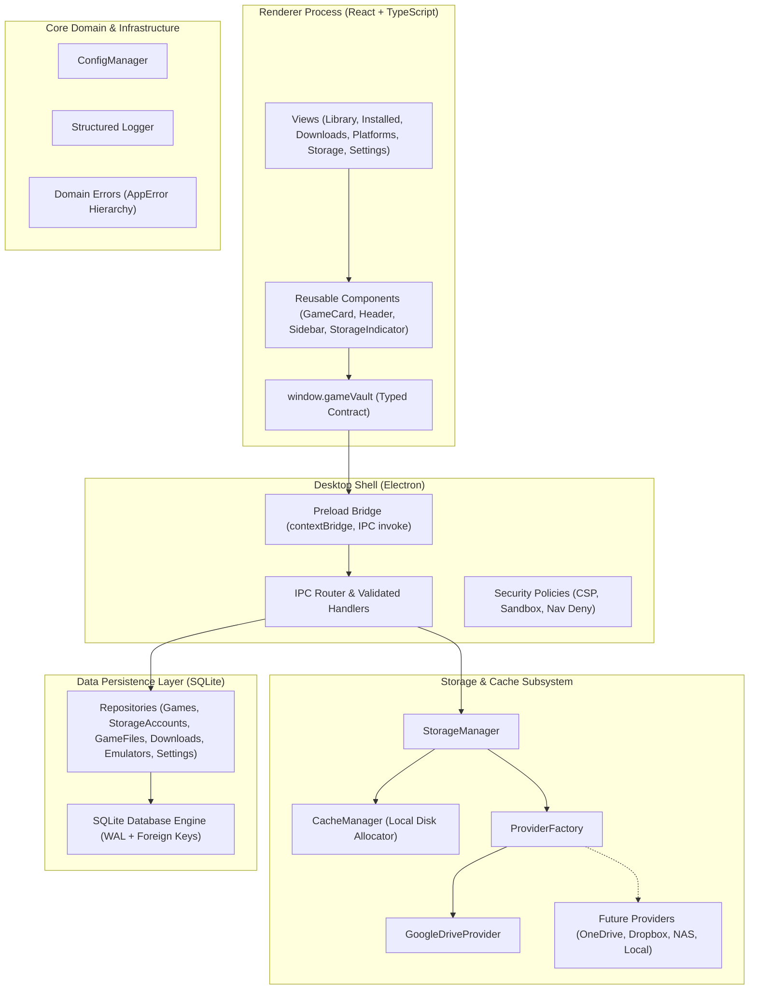
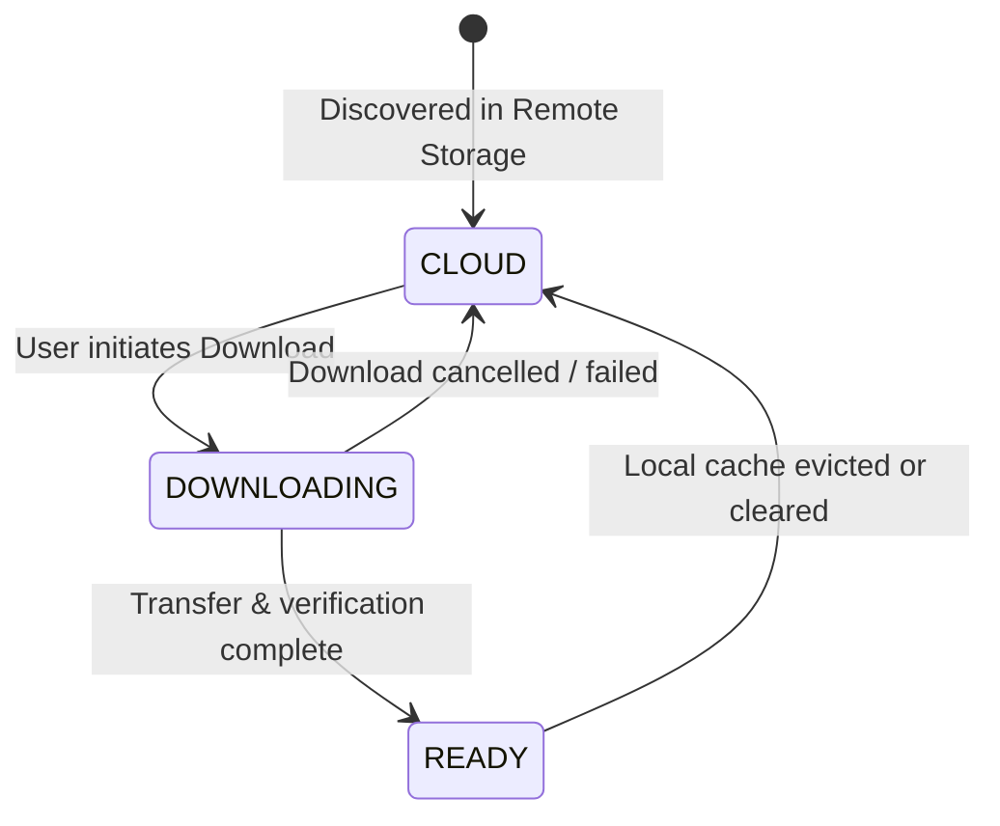
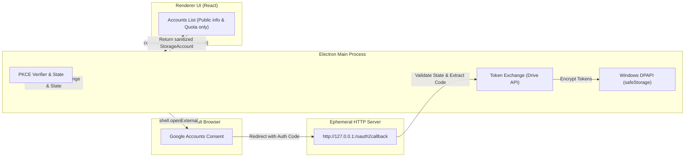

# GAME VAULT — Architecture Design Document

This document outlines the architectural blueprint, module boundaries, communication protocols, and data models of **Game Vault**.

---

## 1. High-Level Architectural Diagram



---

## 2. Directory Structure & Module Boundaries

The project enforces strict, unidirectional boundaries:

```
src/
├── desktop/         # Main & Preload Electron orchestrator
│   ├── main.ts          # Window initialization and lifecycle
│   ├── preload.ts       # contextBridge exposing window.gameVault
│   ├── security.ts      # WebPreferences, CSP headers, link interception
│   └── ipc/             # Strongly typed channels & main process handlers
│
├── ui/              # React Renderer Process
│   ├── components/      # Modular UI components (Header, Sidebar, GameCard, StorageIndicator, etc.)
│   ├── views/           # Views: Library, Installed, Downloads, Platforms, StorageScreen, Settings
│   ├── styles/          # Global styles, dark console theme, responsive CSS grid
│   └── types/           # Electron window typings
│
├── core/            # Domain Core
│   ├── types/           # Core domain models (Game, StorageAccount, GameFile, etc.)
│   ├── errors/          # AppError, DatabaseError, StorageError, ValidationError, etc.
│   ├── logger/          # Structured logger with redaction of sensitive credentials
│   └── config/          # OS-aware path resolution and configuration persistence
│
├── storage/         # Storage & Cache Management
│   ├── StorageManager.ts # Coordinates multi-provider quotas and sessions
│   └── CacheManager.ts   # Local game cache, space tracking, directory sanitation
│
├── providers/       # Storage Providers
│   ├── StorageProvider.ts # The foundational provider interface
│   ├── ProviderFactory.ts # Extensible registry for all storage backends
│   └── google-drive/    # Google Drive provider implementation
│
├── database/        # SQLite Persistence
│   ├── connection.ts    # better-sqlite3 singleton with WAL mode and foreign keys enabled
│   ├── schema.ts        # Idempotent DDL migrations for all 6 tables
│   └── repositories/    # Strongly typed CRUD repositories
│
├── downloads/       # Download Orchestration
│   └── DownloadManager.ts # Queue state machine and progress broadcasting
│
├── launchers/       # Native Game Launching
│   └── LauncherService.ts # Execution validation and process management
│
├── emulators/       # Retro/Console Emulation
│   └── EmulatorService.ts # Emulator registry and ROM dispatching
│
└── metadata/        # Game Metadata Enrichment
    └── MetadataService.ts # Future scraping contracts (IGDB, Steam storefront)
```

---

## 3. StorageProvider Abstraction & Multi-Account Architecture

To ensure Game Vault is never tightly coupled to a single storage provider, all remote backends implement the `StorageProvider` interface:

```typescript
export interface StorageProvider {
  readonly id: string;
  readonly name: string;
  readonly type: StorageProviderType;

  authenticate(credentials?: AuthCredentials): Promise<AuthResult>;
  disconnect(): Promise<void>;
  isConnected(): Promise<boolean>;
  getAccountInfo?(): Promise<{ email?: string; displayName?: string; picture?: string }>;
  listFiles(folderId?: string): Promise<RemoteFile[]>;
  getFile(fileId: string): Promise<RemoteFile>;
  download(
    fileId: string,
    destinationPath: string,
    onProgress?: (progress: DownloadProgress) => void
  ): Promise<DownloadResult>;
  getMetadata(fileId: string): Promise<FileMetadata>;
  getQuota(): Promise<StorageQuota>;
}
```

### Multi-Account Registry
Unlike typical desktop tools that support only one connected cloud account at a time, `StorageManager` maintains an internal `Map<string, StorageProvider>` keyed by account ID. This enables:
- Connecting multiple independent accounts of the same provider (e.g., "Ryan Principal 5 TB" and "Ryan Archive 5 TB").
- Independent authentication state, token refresh cycles, and isolated disconnect operations.
- Dynamic quota aggregation across all active connected accounts without cross-account contamination.

---

## 4. Game Lifecycle & State Machine

Every game in Game Vault transitions across three explicit states:



1. **`CLOUD`**: Game file exists exclusively on the user's remote storage. Metadata, cover art, and size are known and displayed.
2. **`DOWNLOADING`**: Game is actively transfering into the local SSD/HDD cache directory. Progress bar and speed are tracked.
3. **`READY`**: Game is verified, extracted, and present on local disk. Instant "Play" action is enabled.

---

## 5. SQLite Data Schema & Versioned Migrations

Game Vault uses an embedded SQLite database configured in **WAL (Write-Ahead Logging)** mode with active foreign key constraints and a versioned **MigrationRunner**:

### `schema_migrations`
Tracks applied schema migrations to guarantee non-destructive, idempotent database evolution.
- `version` (INTEGER PRIMARY KEY)
- `name` (TEXT)
- `applied_at` (TEXT)

### 1. `games`
Core catalog of indexed titles.
- Primary Key: `id` (UUID)
- Fields: `title`, `slug`, `description`, `cover_url`, `banner_url`, `platform`, `release_year`, `developer`, `publisher`, `state` (`CLOUD` | `DOWNLOADING` | `READY`), `size_bytes`, `installed_path`, `play_time_seconds`, `last_played_at`, `created_at`, `updated_at`.

### 2. `storage_accounts` (Updated in Migration 002)
Connected cloud and network storage accounts.
- Primary Key: `id`
- Fields: `provider_type`, `provider_account_id`, `account_name`, `account_email`, `credential_key`, `status` (`ACTIVE` | `DISCONNECTED` | `ERROR` | `REVOKED`), `quota_total_bytes`, `quota_used_bytes`, `last_synced_at`, `last_authenticated_at`, `created_at`, `updated_at`.
- Indices: `idx_storage_accounts_provider_acc` on `(provider_type, provider_account_id)`.

### 3. `game_files` (Updated in Migration 004)
Remote and local binary files associated with games.
- Primary Key: `id`
- Foreign Keys: `game_id` references `games(id)` ON DELETE CASCADE, `storage_account_id` references `storage_accounts(id)`.
- Fields: `remote_file_id`, `remote_path`, `filename`, `size_bytes`, `md5_checksum`, `status` (`CLOUD` | `DOWNLOADING` | `READY` | `CORRUPTED` | `MISSING`), `local_path`, timestamps.

### 4. `downloads`
Active and historical download queue.
- Primary Key: `id`
- Foreign Keys: `game_id` references `games(id)`, `game_file_id` references `game_files(id)`.
- Fields: `status` (`QUEUED` | `DOWNLOADING` | `PAUSED` | `COMPLETED` | `FAILED` | `CANCELLED`), `total_bytes`, `downloaded_bytes`, `download_speed_bps`, `error_message`, timestamps.

### 5. `emulators`
Configured console emulators.
- Primary Key: `id`
- Fields: `name`, `platform`, `executable_path`, `default_args`, `config_path`, `is_installed`, `version`, timestamps.

### 6. `settings`
Persistent application key-value configuration.
- Primary Key: `key`
- Fields: `value` (JSON serialized), `updated_at`.

### 7. `cloud_files` (Added in Migration 003)
Raw inventory of all discovered files in connected cloud accounts.
- Primary Key: `id` (UUID)
- Foreign Key: `storage_account_id` references `storage_accounts(id)` ON DELETE CASCADE.
- Fields: `remote_file_id`, `name`, `remote_path`, `parent_folder_id`, `size_bytes`, `mime_type`, `md5_checksum`, `is_folder`, `trashed`, `classification`, `confidence_score`, `metadata_json`, timestamps.
- Constraints: `UNIQUE(storage_account_id, remote_file_id)`.

### 8. `storage_sync_state` & `sync_runs` (Added in Migration 004)
Sync tokens and audit logging for initial and incremental synchronization.
- `storage_sync_state`: `storage_account_id`, `initial_scan_completed`, `start_page_token`, `next_change_page_token`, `last_full_scan_at`, `last_incremental_sync_at`, `last_error`, timestamps.
- `sync_runs`: `id`, `storage_account_id`, `started_at`, `finished_at`, `status`, `folders_scanned`, `files_scanned`, `games_detected`, `error_message`.

---

## 6. Security & Authentication Architecture

Game Vault adheres strictly to modern native application security standards:



1. **Native Loopback OAuth 2.0 (RFC 8252)**:
   - Uses an ephemeral local HTTP server bound strictly to `127.0.0.1`.
   - Authorization opens directly in the user's OS browser via `shell.openExternal`.
   - Never uses embedded WebViews, avoiding credential snooping or session hijacking.

2. **PKCE Enforcement (RFC 7636)**:
   - High-entropy cryptographically random `code_verifier` (256-bit).
   - SHA-256 base64url challenge (`S256`) sent to authorization server.
   - Mitigates authorization code injection attacks on desktop clients.

3. **OS-Level Credential Protection (DPAPI)**:
   - OAuth access tokens and refresh tokens are managed via `CredentialStore`.
   - Implemented using Windows DPAPI via Electron's `safeStorage.encryptString()` and `decryptString()`.
   - Fail-secure behavior: throws `CredentialStoreUnavailableError` if OS cryptography is unavailable without explicit override.
   - Credentials are **never** stored in SQLite and are **never** exposed to the renderer process.

4. **Least-Privilege Scopes**:
   - `drive.readonly` (Read-only access to files and metadata).
   - `userinfo.profile` (Display name and avatar).
   - `userinfo.email` (Account identification).
   - Game Vault has zero permission to delete or overwrite user cloud files.

5. **Strict Process Isolation**:
   - `contextIsolation: true`, `sandbox: true`, `nodeIntegration: false`.
   - CSP strictly configured in `src/desktop/security.ts`.
   - IPC channels validate input arguments before handling.

---

## 7. Cloud Inventory & Game Discovery Pipeline (Phase 2B)

See complete design documentation in [docs/CLOUD_SCANNING.md](docs/CLOUD_SCANNING.md).


Key capabilities:
- **Resilient Traversal**: BFS queue avoids call-stack overflow; handles pagination up to 1000 items/page; exponential backoff with jitter on 429/403/5xx errors.
- **Delta Sync**: Anchors `startPageToken` before initial scan and processes incremental changes via `listChanges(pageToken)`.
- **Heuristic Classification**: Discerns exclusive ROMs (0.95–0.99), contextual ambiguous files (`.iso`, `.exe`, `.zip`), and filtered non-game items (`.txt`, `.mp3`).
- **Grouping & Collisions**: Collapses multi-track BIN/CUE games into single entries; generates collision-proof slugs (`${slugify(title)}-${slugify(platform)}`).
- **Non-Destructive Deletion**: Trashed cloud files mark `game_files.status = 'MISSING'` while preserving user catalog metadata and play history.
