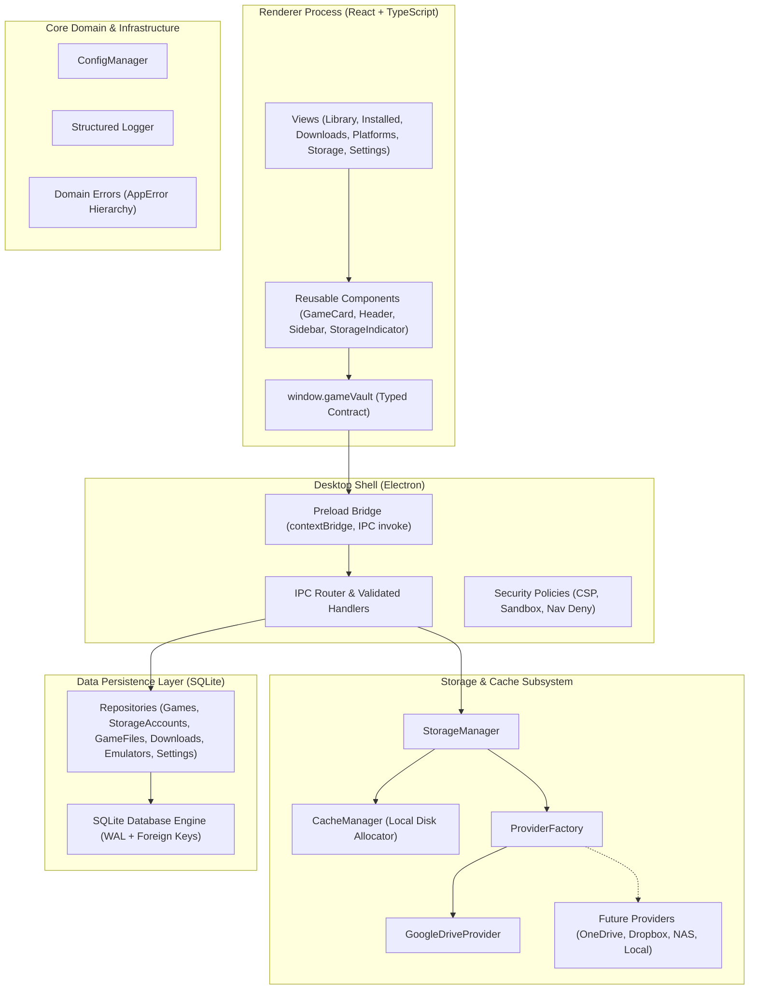
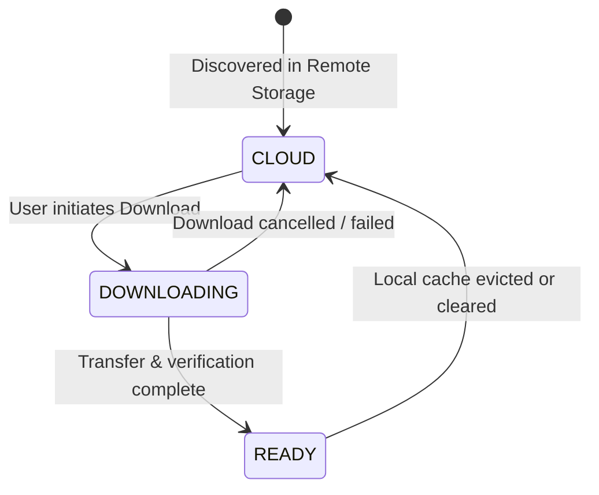

# GAME VAULT — Architecture Design Document

This document outlines the architectural blueprint, module boundaries, communication protocols, and data models of **Game Vault**.

---

## 1. High-Level Architectural Diagram



---

## 2. Directory Structure & Module Boundaries

The project enforces strict, unidirectional boundaries:

```
src/
├── desktop/         # Main & Preload Electron orchestrator
│   ├── main.ts          # Window initialization and lifecycle
│   ├── preload.ts       # contextBridge exposing window.gameVault
│   ├── security.ts      # WebPreferences, CSP headers, link interception
│   └── ipc/             # Strongly typed channels & main process handlers
│
├── ui/              # React Renderer Process
│   ├── components/      # Modular UI components (Header, Sidebar, GameCard, StorageIndicator, etc.)
│   ├── views/           # Views: Library, Installed, Downloads, Platforms, StorageScreen, Settings
│   ├── styles/          # Global styles, dark console theme, responsive CSS grid
│   └── types/           # Electron window typings
│
├── core/            # Domain Core
│   ├── types/           # Core domain models (Game, StorageAccount, GameFile, etc.)
│   ├── errors/          # AppError, DatabaseError, StorageError, ValidationError, etc.
│   ├── logger/          # Structured logger with redaction of sensitive credentials
│   └── config/          # OS-aware path resolution and configuration persistence
│
├── storage/         # Storage & Cache Management
│   ├── StorageManager.ts # Coordinates multi-provider quotas and sessions
│   └── CacheManager.ts   # Local game cache, space tracking, directory sanitation
│
├── providers/       # Storage Providers
│   ├── StorageProvider.ts # The foundational provider interface
│   ├── ProviderFactory.ts # Extensible registry for all storage backends
│   └── google-drive/    # Google Drive provider implementation
│
├── database/        # SQLite Persistence
│   ├── connection.ts    # better-sqlite3 singleton with WAL mode and foreign keys enabled
│   ├── schema.ts        # Idempotent DDL migrations for all 6 tables
│   └── repositories/    # Strongly typed CRUD repositories
│
├── downloads/       # Download Orchestration
│   └── DownloadManager.ts # Queue state machine and progress broadcasting
│
├── launchers/       # Native Game Launching
│   └── LauncherService.ts # Execution validation and process management
│
├── emulators/       # Retro/Console Emulation
│   └── EmulatorService.ts # Emulator registry and ROM dispatching
│
└── metadata/        # Game Metadata Enrichment
    └── MetadataService.ts # Future scraping contracts (IGDB, Steam storefront)
```

---

## 3. StorageProvider Abstraction

To ensure Game Vault is never tightly coupled to a single storage provider, all remote backends implement the `StorageProvider` interface:

```typescript
export interface StorageProvider {
  readonly id: string;
  readonly name: string;
  readonly type: StorageProviderType;

  authenticate(credentials?: AuthCredentials): Promise<AuthResult>;
  disconnect(): Promise<void>;
  isConnected(): Promise<boolean>;
  listFiles(folderId?: string): Promise<RemoteFile[]>;
  getFile(fileId: string): Promise<RemoteFile>;
  download(
    fileId: string,
    destinationPath: string,
    onProgress?: (progress: DownloadProgress) => void
  ): Promise<DownloadResult>;
  getMetadata(fileId: string): Promise<FileMetadata>;
  getQuota(): Promise<StorageQuota>;
}
```

### Provider Registration
New providers are registered through `ProviderFactory.register(type, Constructor)`. The UI and Core interact exclusively with `StorageManager`, completely oblivious to provider-specific SDKs or HTTP mechanics.

---

## 4. Game Lifecycle & State Machine

Every game in Game Vault transitions across three explicit states:



1. **`CLOUD`**: Game file exists exclusively on the user's remote storage. Metadata, cover art, and size are known and displayed.
2. **`DOWNLOADING`**: Game is actively transferring into the local SSD/HDD cache directory. Progress bar and speed are tracked.
3. **`READY`**: Game is verified, extracted, and present on local disk. Instant "Play" action is enabled.

---

## 5. SQLite Data Schema

Game Vault uses an embedded SQLite database configured in **WAL (Write-Ahead Logging)** mode with active foreign key constraints:

### 1. `games`
Core catalog of indexed titles.
- Primary Key: `id` (UUID)
- Fields: `title`, `slug`, `description`, `cover_url`, `banner_url`, `platform`, `release_year`, `developer`, `publisher`, `state` (`CLOUD` | `DOWNLOADING` | `READY`), `size_bytes`, `installed_path`, `play_time_seconds`, `last_played_at`, `created_at`, `updated_at`.

### 2. `storage_accounts`
Connected cloud and network storage accounts.
- Primary Key: `id`
- Fields: `provider_type`, `account_name`, `account_email`, `status` (`ACTIVE` | `DISCONNECTED` | `ERROR` | `REVOKED`), `quota_total_bytes`, `quota_used_bytes`, `auth_config_secure_ref`, `last_synced_at`, `created_at`, `updated_at`.

### 3. `game_files`
Remote and local binary files associated with games.
- Primary Key: `id`
- Foreign Keys: `game_id` references `games(id)` ON DELETE CASCADE, `storage_account_id` references `storage_accounts(id)`.
- Fields: `remote_file_id`, `remote_path`, `filename`, `size_bytes`, `md5_checksum`, `status` (`REMOTE` | `DOWNLOADING` | `CACHED_LOCAL`), `local_path`, timestamps.

### 4. `downloads`
Active and historical download queue.
- Primary Key: `id`
- Foreign Keys: `game_id` references `games(id)`, `game_file_id` references `game_files(id)`.
- Fields: `status` (`QUEUED` | `DOWNLOADING` | `PAUSED` | `COMPLETED` | `FAILED` | `CANCELLED`), `total_bytes`, `downloaded_bytes`, `download_speed_bps`, `error_message`, timestamps.

### 5. `emulators`
Configured console emulators.
- Primary Key: `id`
- Fields: `name`, `platform`, `executable_path`, `default_args`, `config_path`, `is_installed`, `version`, timestamps.

### 6. `settings`
Persistent application key-value configuration.
- Primary Key: `key`
- Fields: `value` (JSON serialized), `updated_at`.

---

## 6. Security Model

1. **Context Isolation**: `contextIsolation: true` in all BrowserWindow instances.
2. **Sandbox Protection**: `sandbox: true` prevents unauthorized system calls from renderers.
3. **No Node Integration**: `nodeIntegration: false`. The renderer cannot require modules or touch file systems directly.
4. **Strict CSP**: Restricts script execution to local bundles, disallows `eval()`, and restricts image and network origins.
5. **No Plaintext Secrets**: OAuth credentials and user tokens are never committed or stored in plaintext database fields; references point to the OS-encrypted credential store.
