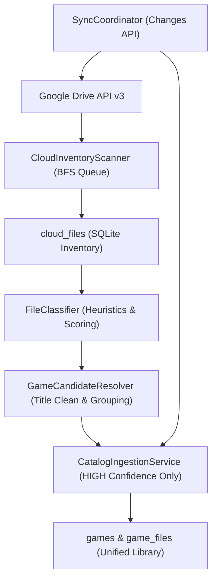

# Cloud Inventory, Game Discovery & Catalog Ingestion Architecture 🚀

## 1. Overview & Core Principle

In **Game Vault**, our central product tenet is:
> **"The user collects games, not files."**

The user should never need to manage Google Drive file IDs, directory hierarchies, complex MIME types, OAuth tokens, or raw ROM file extensions. The cloud discovery engine transparently inventories remote storage providers, classifies files using contextual heuristic rules, groups related files (such as multi-track `.bin` / `.cue` files or multi-disc games), and ingests only high-confidence game candidates into the unified catalog.

---

## 2. Component Pipeline

The ingestion pipeline follows a strict, unidirectional processing flow:

---

## 3. Cloud Inventory Scanner (`CloudInventoryScanner`)

### 3.1 Queue-Based Breadth-First Search (BFS)
- Traverses the user's remote Google Drive folder structure hierarchically using a FIFO queue.
- Avoids call-stack recursion overflow even for deeply nested directories (e.g., 10+ levels).
- Reconstructs accurate absolute virtual paths (e.g., `/Emulation/Roms/PS1/Final Fantasy VII/Disc1.bin`).
- Operates in configurable batch transactions (default: 50 records per SQLite write) for optimal database performance.

### 3.2 Pagination & Large Directory Handling
- Leverages `listPaginatedFiles` supporting page sizes up to **1000 items** per request.
- Loops through continuation tokens (`nextPageToken`) until all items in a folder are inventoried.
- Accurately distinguishes folder nodes (`isFolder = true`) from file items (`isFolder = false`), maintaining strictly independent counts in sync metrics.

### 3.3 Network Resilience & Rate Limiting
- Built-in `fetchWithRetry` utility handles Google API rate limits (`429 Too Many Requests`), transient backend errors (`500`, `502`, `503`, `504`), and `403 rateLimitExceeded`.
- Uses exponential backoff with randomized jitter:
  $$\text{delay} = \min(2^{\text{attempt}} \times 500\text{ms} + \text{rand}(0, 250\text{ms}), 10000\text{ms})$$
- Retries up to 4 consecutive attempts before reporting a non-fatal account error.

### 3.4 Cancellation Token
- Every scan loop checks `cancellationToken.isCancelled`.
- In-flight operations can be cancelled immediately from the UI via `window.gameVault.sync.cancelScan(accountId)`.
- On cancellation, all scanned records up to that point remain saved in SQLite; the sync run is cleanly transitioned to `'CANCELLED'`.

---

## 4. Google Drive Changes API & Incremental Delta Sync

### 4.1 Token Anchoring
- Prior to executing a full initial scan, `SyncCoordinator` captures an anchor `startPageToken` via `getStartPageToken()`.
- On subsequent scans for the same storage account, `SyncCoordinator` uses `listChanges(pageToken)` to query only changes that occurred since the last sync.

### 4.2 Non-Destructive Catalog Updates
- **File Moved or Renamed:** Updated in-place in `cloud_files` and `game_files.remote_path`. The associated game entity and its user play history (play time, last played) remain untouched.
- **File Trashed or Deleted:** Flagged as `trashed = 1` in `cloud_files` and transitioned to `status = 'MISSING'` in `game_files`. Catalog entries are **never** deleted, ensuring user play history, custom covers, and notes are preserved.
- **File Restored:** If a previously missing file reappears in changes, its status automatically returns to `'CLOUD'`.

---

## 5. File Classification & Confidence Scoring

Files are evaluated by `FileClassifier` across three categories:

| Category | Extensions | Default Action |
| :--- | :--- | :--- |
| **Exclusive ROMs** | `.z64`, `.n64`, `.v64`, `.nes`, `.sfc`, `.smc`, `.gba`, `.gbc`, `.gb`, `.nds`, `.3ds`, `.nsp`, `.xci`, `.cso`, `.chd`, `.rvz`, `.wbfs`, `.gcm`, `.cdi`, `.pbp` | High Confidence (0.95–0.99) — Direct Ingestion |
| **Ambiguous Formats** | `.iso`, `.zip`, `.7z`, `.rar`, `.bin`, `.cue`, `.exe` | Contextual Evaluation — Evaluated against folder paths and siblings |
| **Ignored / Ancillary** | `.txt`, `.nfo`, `.srm`, `.sav`, `.mp3`, `.ogg`, `.flac`, `.jpg`, `.png`, `.db`, `.ini`, `.ds_store` | Low Confidence (0.05–0.10) — Never Ingested |

### 5.1 Contextual Heuristics for Ambiguous Files
- **Console ISOs:** Disc images (`.iso`) located in console folders (e.g., `/PS2/`, `/GameCube/`, `/Wii/`, `/PSP/`) receive HIGH confidence (0.85–0.95).
- **Generic ZIP/7Z/RAR:** Compressed archives only achieve HIGH confidence if contained in an explicit ROM/emulator folder or accompanied by emulator cues.
- **Windows Executables (`.exe`):** Generic executables (e.g., `setup.exe`, `unins000.exe`, `DXSETUP.exe`, `vcredist.exe`) are filtered out. Game executables in dedicated game folders receive HIGH confidence.

### 5.2 Confidence Thresholds
- **HIGH ($\ge 0.75$):** Eligible for automatic ingestion into the user's catalog.
- **MEDIUM ($0.50 \le \text{score} < 0.75$):** Stored in `cloud_files` for potential manual review.
- **LOW ($< 0.50$):** Retained in inventory only; skipped during catalog ingestion.

---

## 6. Game Candidate Resolver

### 6.1 Title Normalization
Removes scene release tags, region markers, revision flags, and translation credits to extract clean display titles:
- `Super Mario 64 (USA).z64` $\rightarrow$ `Super Mario 64`
- `Chrono Trigger [En by RPGOne v1.0].smc` $\rightarrow$ `Chrono Trigger`
- `Crash Bandicoot (USA) (Track 01).bin` $\rightarrow$ `Crash Bandicoot`

### 6.2 Multi-Track BIN/CUE Grouping
- Many CD-based systems (PS1, Sega Saturn, PC Engine CD) represent games as a `.cue` sheet accompanying multiple `.bin` audio/data tracks.
- `GameCandidateResolver` groups all related `.bin` tracks and `.cue` files in the same directory into a single `GameCandidate`.
- A 25-track PlayStation game appears as **1 game** with 25 associated file parts.

### 6.3 Multi-Disc Detection
- Multi-disc games (e.g., `Final Fantasy VII (Disc 1)`, `Final Fantasy VII (Disc 2)`) are recognized and grouped or resolved with disc markers (`discNumber`), maintaining clean single or linked game entities.

### 6.4 Collision-Proof Slugs
- Game slugs are uniquely keyed by title and platform:
  $$\text{slug} = \text{slugify}(\text{title}) + \text{"-"} + \text{slugify}(\text{platform})$$
- For example, `Chrono Trigger` on SNES produces `chrono-trigger-snes`, while `Chrono Trigger` on Nintendo DS produces `chrono-trigger-nds`.
- Both games coexist cleanly in the unified library without collision.

---

## 7. Database Migrations

### `003_cloud_inventory`
- Creates `cloud_files` table:
  - `id`, `storage_account_id`, `remote_file_id`, `name`, `remote_path`, `parent_folder_id`, `size_bytes`, `mime_type`, `md5_checksum`, `is_folder`, `trashed`, `classification`, `confidence_score`, `metadata_json`, `created_at`, `updated_at`.
  - Enforces `UNIQUE(storage_account_id, remote_file_id)`.
  - Indexes `storage_account_id`, `remote_path`, and `classification`.

### `004_storage_sync_state`
- Creates `storage_sync_state` table for tracking `start_page_token`, `next_change_page_token`, and timestamps per account.
- Creates `sync_runs` table for auditing sync run metrics (`folders_scanned`, `files_scanned`, `games_detected`, `error_message`).
- Migrates `game_files` table cleanly with a new check constraint allowing `status IN ('CLOUD', 'DOWNLOADING', 'READY', 'CORRUPTED', 'MISSING')` without data loss.

---

## 8. Security & Zero-Trust Architecture

- **Fail-Secure Credential Store:** DPAPI token storage fails securely if system cryptography is unavailable, preventing unencrypted plaintext leaks unless explicitly overridden in headless test environments.
- **Zero Token Leakage:** Authentication tokens never cross IPC channels or enter renderer state.
- **Scoped Read-Only Access:** Google Drive is accessed strictly via `drive.readonly`.
