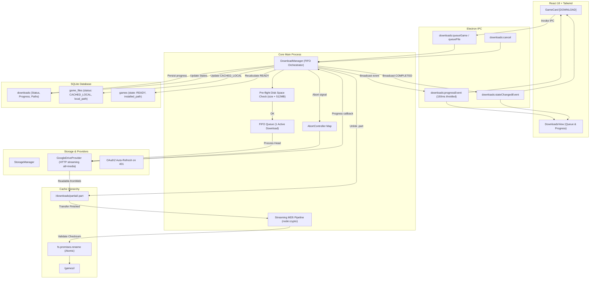
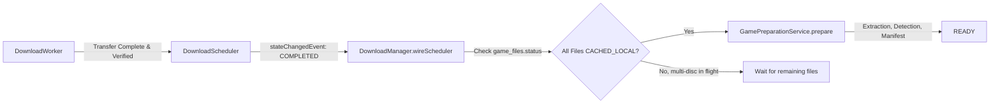

# Game Vault — Resumable Download Engine & Multi-Download Control (Phase 3B) 🚀

## 1. Overview & Core Product Principle

> **"O usuário coleciona jogos, não arquivos."**
> 
> O usuário enxerga sua biblioteca com foco nos jogos:
> ```text
> Gran Turismo 4
> 8.4 GB
> ☁ CLOUD
> [ DOWNLOAD ]
>       ↓
> Gran Turismo 4
> 3.7 GB / 8.4 GB (44%)
> [ PAUSE ]
>       ↓
> PAUSED
> 
> Fechar o Game Vault. Reabrir.
>       ↓
> Gran Turismo 4
> 3.7 GB / 8.4 GB
> [ RESUME ]
>       ↓
> Continua de onde parou (Range: bytes=3700000000-)
>       ↓
> Gran Turismo 4
> ⚡ READY
> [ PLAY ]
> ```
> O usuário nunca perde horas de download por fechar o aplicativo, queda de internet, reiniciar o PC ou pausar manualmente.

Phase 3B transforms the transfer subsystem into a production-grade, highly resilient engine featuring **HTTP Range request resumption**, **persistent partial files**, **Pause and Resume controls**, a **multi-download concurrent scheduler (1–4 configurable slots)**, **priority reordering ("Download Next")**, **exponential backoff with jitter**, **self-healing corrupt partial handling**, and **crash recovery**.

---

## 2. Architecture & Transfer Pipeline



---

## 3. Multi-Download Concurrent Scheduler & Priority FIFO

Phase 3B introduces `DownloadScheduler` with configurable concurrency:
1. **Configurable Slots (1 to 4):** Users can adjust the concurrency limit between 1 and 4 concurrent downloads (default: **2**).
2. **Deterministic Priority FIFO:**
   - Queue order is determined by `ORDER BY priority DESC, created_at ASC`.
   - Items start with `priority = 0`.
   - Clicking **"Download Next"** (Prioritize) queries `MAX(priority) + 1` and elevates the queued item to the front of the line.
3. **Queue States:**
   - `QUEUED`: Item is in the database, waiting for an available concurrency slot.
   - `DOWNLOADING`: Active transfer running in a dedicated `DownloadWorker`.
   - `PAUSED`: Transfer stopped manually, by app shutdown, or after network retry exhaustion; `.part` is strictly preserved.
   - `COMPLETED`: Checksum verified and atomically moved to `<cacheDir>/games/<gameId>/<filename>`.
   - `FAILED`: Permanently aborted due to unrecoverable fatal error (e.g. `RemoteNotFoundError`).
   - `CANCELLED`: Interrupted by user action; `.part` file is deleted immediately.

When any slot frees (completion, pause, cancellation, failure), the scheduler immediately dispatches the next eligible `QUEUED` item.

---

## 4. Pre-Flight Disk Space Validation & Safety Buffer

Before allocating any resources, creating temporary files, or initiating network requests, `DownloadManager` executes a pre-flight disk space check:
- **Safety Margin:** 512 MB (`DISK_SAFETY_MARGIN_BYTES = 512 * 1024 * 1024`).
- **Required Space:** `file.sizeBytes + 512 MB`.
- **Query Mechanism:** `CacheManager.getAvailableDiskSpace()` leverages `fs.statfsSync(cacheDir)` on supported Node environments, with fallback estimation.
- **Fail-Secure Behavior:** If free space is insufficient, the engine throws `InsufficientDiskSpaceError`, records status `FAILED` with `INSUFFICIENT_DISK_SPACE` in the database, notifies listeners, and prevents any `.part` file from being created.

---

## 5. Streaming HTTP Transfer & Backpressure Control

Game files range from megabytes to tens of gigabytes (e.g. DVD ISOs). To guarantee minimal memory consumption:
1. Direct Google Drive API v3 HTTP streaming using `alt=media`.
2. The response body is consumed via `Readable.fromWeb(response.body as any)` and piped directly into an `fs.createWriteStream`.
3. Node streams handle backpressure automatically: if disk I/O slows down, reading from the network pauses.
4. **Memory Stability:** Peak RAM consumption remains flat (< 15 MB heap growth) even when streaming 50+ MB or multi-GB files.

---

## 6. Path Safety & Windows Filename Sanitization

Cloud filenames are untrusted input. The `sanitizeFilename` utility defends against directory traversal and Windows filesystem peculiarities:
- **Directory Traversal Defense:** Strips `../`, `..\`, absolute paths (`/etc/shadow`, `C:\Windows\System32`).
- **Illegal Character Substitution:** Replaces `:`, `*`, `?`, `"`, `<`, `>`, `|` with underscores (`_`).
- **Windows Reserved Names:** Prefixes device names (`CON`, `PRN`, `AUX`, `NUL`, `COM1`-`COM9`, `LPT1`-`LPT9`) with an underscore (`_CON.iso`).
- **Trailing Dots & Spaces:** Strips trailing dots and whitespace that Windows NTFS/FAT32 rejects.
- **Length Truncation:** Truncates excessive filenames to $\le 255$ characters while preserving the original file extension.
- **Boundary Verification:** `isSubPath(targetDir, resolvedPath)` confirms that the final path never escapes the designated cache directory.

---

## 7. Cryptographic Integrity Validation (Streaming MD5)

1. During or immediately after streaming, the engine computes the file's MD5 checksum using `calculateFileMd5(partialPath)`.
2. Calculation is executed via `stream/promises.pipeline` with `node:crypto.createHash('md5')`, ensuring the file is never read entirely into RAM.
3. If the remote provider supplied an MD5 checksum (Google Drive provides this metadata), the computed hash is compared case-insensitively.
4. **Checksum Mismatch:**
   - If computed MD5 $\ne$ expected MD5, throws `ChecksumMismatchError`.
   - The `.part` file is deleted immediately.
   - Destination file is **never created**.
   - Download is marked `FAILED` with reason `CHECKSUM_MISMATCH`.
   - Game state remains `CLOUD`.
5. **Fallback:** If remote MD5 is absent, exact file size matching is enforced.

---

## 8. Atomic Rename & Cache Finalization

To avoid partial or corrupted game files being seen as playable:
1. Active transfers write strictly to `<cacheDir>/downloads/partial/<downloadId>.part`.
2. Only after size and checksum validation pass does `DownloadManager` invoke:
   ```typescript
   await fs.promises.rename(partialPath, destinationPath);
   ```
3. Because both the `partial` directory and the `games` directory reside within the same configured cache root, `rename` is an atomic filesystem operation.
4. Only upon successful atomic rename is the database updated:
   - `game_files.status` $\rightarrow$ `CACHED_LOCAL`, `local_path` $\rightarrow$ destination.
   - `downloads.status` $\rightarrow$ `COMPLETED`.
   - Affected game's `state` $\rightarrow$ `READY` (with `installed_path`).

---

## 9. Pause, Resume & Cancellation Controls

### Pause
- When `DownloadManager.pauseDownload(downloadId)` is triggered:
  1. The active `DownloadWorker` flushes its writable stream.
  2. The partial `.part` file is **strictly preserved**.
  3. Status transitions to `PAUSED` in SQLite and updates `downloadedBytes` to disk size.
  4. The concurrency slot is released immediately, allowing the scheduler to dispatch the next item.

### Resume
- When `DownloadManager.resumeDownload(downloadId)` is called:
  1. Status transitions to `QUEUED`.
  2. The scheduler acquires an available concurrency slot.
  3. The worker validates the existing `.part` file and checks for remote mutations.
  4. Resumes transfer via HTTP `Range: bytes=<offset>-`.

### Cancellation
- When `DownloadManager.cancelDownload(downloadId)` is invoked:
  1. Aborts in-flight HTTP request via `AbortController`.
  2. Synchronously deletes the `.part` file from `<cacheDir>/downloads/partial/`.
  3. Sets status to `CANCELLED`.
  4. Releases concurrency slot immediately.

---

## 10. Crash Recovery & Startup Self-Healing

If the host machine loses power, the application is force-killed, or an unexpected exit occurs during a download:
1. On application startup, `DownloadManager.recoverStaleDownloads()` queries SQLite for any download in `DOWNLOADING` status.
2. For each stale record:
   - Sets status to `PAUSED` with error code `INTERRUPTED_BY_APP_EXIT`.
   - Checks `<cacheDir>/downloads/partial/<downloadId>.part` on disk.
   - If `.part` exists and size $\le$ `totalBytes`: preserves file and updates `downloadedBytes` to match disk size.
   - If `.part` is oversized: self-healing removes the corrupt file and resets progress to 0.
   - Recalculates game state via `GameAvailabilityService`.
3. The launcher starts cleanly with no lost bytes and allows the user to click `[ RESUME ]` immediately.

---

## 11. Game State Lifecycle Matrix

| Scenario | Game State | Download Status | Game Files Status | Installed Path |
| :--- | :--- | :--- | :--- | :--- |
| Initial state (un-downloaded) | `CLOUD` | None | `REMOTE` | `null` |
| User clicks [ Download ] | `DOWNLOADING` | `QUEUED` / `DOWNLOADING` | `REMOTE` | `null` |
| User pauses download | `DOWNLOADING` | `PAUSED` | `REMOTE` | `null` |
| App crashes / restarts | `DOWNLOADING` | `PAUSED` (`INTERRUPTED_BY_APP_EXIT`) | `REMOTE` | `null` |
| User cancels download | `CLOUD` | `CANCELLED` | `REMOTE` | `null` |
| 1-file game download complete | `READY` | `COMPLETED` | `CACHED_LOCAL` | `<cacheDir>/games/<id>/file.iso` |
| Multi-file game (1 of 2 files downloaded) | `CLOUD` | File 1: `COMPLETED`, File 2: None | File 1: `CACHED_LOCAL`, File 2: `REMOTE` | `null` |
| Multi-file game (all files downloaded) | `READY` | All: `COMPLETED` | All: `CACHED_LOCAL` | `<cacheDir>/games/<id>/main.cue` |

---

## 12. Security & Zero Token Leakage

- Authentication tokens, Google OAuth secrets, and refresh credentials remain strictly confined to the Main Process.
- Zero auth tokens, client secrets, or Authorization headers are exposed via IPC, state events, logs, or renderer DOM.
- Automatic token refresh on HTTP 401 is handled transparently inside `GoogleDriveProvider`.

---

## 13. Download-to-Preparation Auto-Handoff (Phase 3C Pipeline Integration)

Following the core philosophy **"O usuário coleciona jogos, não arquivos"**, downloads do not end merely with an archive sitting in cache. As soon as all required files for a game are transferred:



1. **Detection of Completion:** The scheduler callback in `DownloadManager.wireScheduler()` inspects `game_files` in SQLite for the affected `gameId`.
2. **Multi-File / Multi-Disc Awareness:** If a game comprises multiple parts or discs (e.g. disc 1 & disc 2), preparation is only triggered when *all* associated game files exist on disk with status `CACHED_LOCAL`.
3. **Non-Blocking Asynchronous Dispatch:** `GamePreparationService.prepare(gameId)` is launched asynchronously (`.catch(...)`), ensuring the download scheduler slot is immediately freed to process the next item in queue without waiting for archive extraction.
4. **State Transition:** The game status seamlessly transitions:
   `DOWNLOADING` $\rightarrow$ `PREPARING` $\rightarrow$ `READY`.

