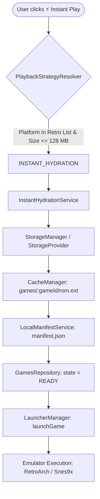

# Game Vault — Instant Play Engine (Phase 4C) ⚡

## 1. Overview & Core Philosophy

> **"Cloud é implementação, não experiência."**
>
> Para jogos retrô e plataformas compactas (NES, SNES, Game Boy, Game Boy Color, Game Boy Advance, Nintendo DS, N64, Genesis/Mega Drive e títulos de até 128 MB), o usuário não deve esperar pelo ciclo manual de download.
>
> Ao ver:
> ```text
> Super Mario World
> SNES • 4 MB
> [ ⚡ Instant Play ]
> ```
> O Game Vault realiza a **hidratação instantânea** (*Instant Hydration*) de forma transparente em segundo plano, gravando os dados diretamente na pasta de cache gerenciada pelo `CacheManager`, gerando o `manifest.json` local e acionando o emulador configurado em menos de 2 segundos.

---

## 2. Architecture: Instant Hydration Pipeline



### 2.1 State Transitions
1. **Initial State:** `Game.state = CLOUD`.
2. **Hydration Triggered:** `InstantHydrationService.hydrateGame(gameId)` downloads the small ROM file directly into `.gamevault/cache/games/<gameId>/`.
3. **Local Manifest:** Manifest is generated with `primaryExecutableOrRom` pointing to the hydrated file.
4. **State Ready:** `Game.state` transitions atomically to `READY` with `installedPath` updated.
5. **Execution:** `LauncherManager` launches the emulator immediately with zero extra user interaction.

---

## 3. Playback Strategy Decision Matrix

The `PlaybackStrategyResolver` decides the optimal strategy based on game size, platform, network conditions, and storage provider capabilities:

| Strategy | Platform / Conditions | Typical Size | User Experience |
| :--- | :--- | :--- | :--- |
| **`INSTANT_HYDRATION`** | Retro (NES, SNES, GB, GBA, N64, NDS, etc.) | $\le 128\text{ MB}$ | Downloads directly to cache and launches instantly ($\le 2\text{s}$) |
| **`PROGRESSIVE_PLAY`** | PS1 (.chd), StorageProvider with HTTP Range support, Good/Excellent Network | $128\text{ MB} - 700\text{ MB}$ | Mounts localhost streaming server on ephemeral port, prefetching 4 MB blocks on demand |
| **`LOCAL_REQUIRED`** | Heavy platforms (PS2, GameCube, Wii, native PC), or Poor Network, or user set `always_local` | $> 700\text{ MB}$ or heavy ISO | Full download and preparation required before playing |

---

## 4. UI/UX Controls & Preferences

### 4.1 Game Cards & Badges
- Eligible cloud games display a distinctive `⚡ Instant` badge.
- Clicking the play button triggers instant hydration and emulator launch seamlessly.

### 4.2 Game Details Profile Override
In game details, users can configure `Playback Mode`:
- **Auto (Default):** Resolves automatically based on platform and network capability.
- **Always Local:** Enforces a complete local download prior to execution.
- **Experimental Streaming:** Forces progressive block streaming when compatible.

### 4.3 Settings Controls
Under **Settings > Instant Play & Progressive ROM Streaming**:
- **Instant Hydration Max Size:** Configurable threshold (default: 128 MB).
- **Streaming Cache Limit:** Maximum size for chunked block cache (default: 10 GB).
- **Read-Ahead Blocks:** Number of sequential blocks to prefetch ahead (default: 2 blocks = 8 MB).
- **Finish Caching in Background:** Toggle whether in-flight streamed games continue caching remaining blocks while playing.
- **Purge Cache:** Instant button to clean all streaming block fragments.
