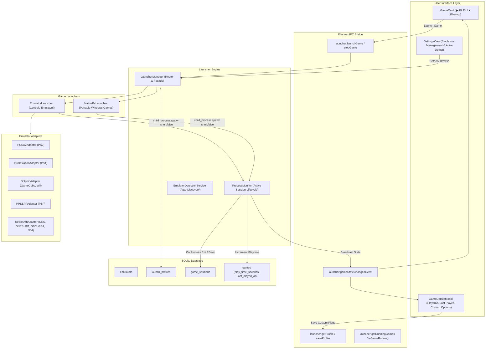

# Game Vault — Launcher Engine Architecture & Execution Subsystem (Phase 4A) 🎮🚀

## 1. Overview & Core Philosophy

> **"O usuário joga jogos, não executáveis."**
>
> O jogador não deve precisar pensar em:
> - Nomes de executáveis (`pcsx2-qt.exe`, `dolphin.exe`, `retroarch.exe`)
> - Flags de linha de comando (`-fullscreen`, `-b`, `-e`, `-L`, `--`)
> - Caminhos absolutos de ISOs, ROMs ou imagens CHD
> - Gerenciamento de diretórios de trabalho (*working directories*)
> - Rastreamento manual de tempo de jogo ou status de sessões

Phase 4A fecha o ciclo completo de vida de um jogo dentro do Game Vault:
```text
  CLOUD
    ↓ [Download Automático / Retomável]
DOWNLOADING
    ↓ [Extração, Descompressão & Detecção de ROM]
PREPARING
    ↓ [Manifesto Local & Registro de Integridade]
  READY
    ↓ [ ▶ PLAY ]
  PLAY (Monitoramento ativo de processo, Zero Shell Injection, Registro de Playtime)
```

---

## 2. Architecture Diagram



---

## 3. Launcher Component Breakdown

### 3.1 `LauncherManager`
O ponto focal da API de execução. Suas responsabilidades incluem:
1. **Validação Pré-Execução:**
   - Verifica se o jogo está no estado `READY`.
   - Verifica a existência física da ROM/executável no disco. Se o arquivo foi removido externamente, aciona o `GameAvailabilityService` para reconciliar o estado do jogo para `CLOUD` e lança `RomNotFoundError`.
   - Valida se o emulador configurado existe fisicamente no disco.
2. **Resolução de Perfil de Execução (`LaunchProfile`):**
   - Resolve o perfil customizado do usuário (`launch_profiles`) ou constrói dinamicamente um perfil padrão (fullscreen ativado por padrão).
   - Resolve o emulador padrão para a plataforma quando o perfil não especifica um ID ou aponta para um emulador desativado.
3. **Seleção de Launcher:**
   - Encaminha jogos de plataforma `PC` para o `NativePcLauncher`.
   - Encaminha plataformas de console para o `EmulatorLauncher`.
4. **Construção do Comando Imutável:**
   - Gera o objeto `LaunchCommand` (`{ executable, args: string[], cwd }`).
5. **Atualização de Acesso:**
   - Atualiza `last_accessed_at` no banco para políticas de retenção de cache.
6. **Despacho ao ProcessMonitor:**
   - Encaminha o comando seguro para monitoramento contínuo.

### 3.2 `ProcessMonitor`
Gerenciador de ciclo de vida de subprocessos:
- **Prevenção de Execuções Múltiplas:** Impede que o mesmo jogo seja lançado simultaneamente (`GameAlreadyRunningError`).
- **Zero Shell Execution:** Executa estritamente via `child_process.spawn(executable, args, { shell: false })`.
- **Rastreamento de Sessão:**
  - Gera `sessionId` único (`sess_<timestamp>_<rand>`).
  - Grava registro inicial em `game_sessions` com `started_at`.
  - Notifica ouvintes locais e frontend via IPC (`isRunning: true`).
- **Tratamento de Saída (`exit` e `error`):**
  - Calcula a duração exata da sessão: `durationSeconds = max(0, round((endedAt - startedAt) / 1000))`.
  - Detecta crashes se o código de saída for diferente de zero ou se houve sinal de encerramento (`crashed = (code !== 0) || signal !== null`).
  - **Preservação de Playtime:** Mesmo que o emulador sofra um crash inesperado, o tempo jogado até o crash é registrado em `game_sessions` e adicionado a `games.play_time_seconds`.
  - Atualiza atomicamente `games.play_time_seconds` e `games.last_played_at`.
  - Notifica ouvintes locais e frontend via IPC (`isRunning: false`).

---

## 4. Zero Shell Injection & Security Model

> [!IMPORTANT]
> **Garantia Absoluta contra Shell Injection:**
> - Todos os argumentos de linha de comando (incluindo nomes de arquivos de jogos contendo espaços, caracteres Unicode ou metacaracteres perigosos como `;`, `&`, `|`, `>`, `$`) são passados como elementos individuais no vetor `args: string[]`.
> - A chamada ao sistema operacional utiliza exclusivamente `shell: false`.
> - **Nenhum comando é executado via `cmd.exe`, `powershell.exe` ou `sh`.**
> - Tentativas de injeção maliciosa em nomes de arquivos (ex.: `Gran Turismo; calc.exe && rm -rf /`) são tratadas literalmente pelo sistema operacional como um único argumento de caminho de arquivo, impedindo qualquer execução de comandos arbitrários.

---

## 5. Graceful Shutdown & Process Decoupling

Quando o Game Vault é fechado ou o usuário sai do aplicativo:
1. O método `processMonitor.shutdown()` é invocado no evento `will-quit` do Electron.
2. Para cada sessão ativa em memória:
   - O tempo de jogo decorrido até o instante de fechamento do Game Vault é computado e gravado no banco de dados SQLite.
   - O processo filho recebe `child.unref()`, garantindo que **o jogo em execução não é abruptamente interrompido**, permitindo que o usuário continue jogando sem perda de progresso no jogo.
3. As sessões em aberto no banco são finalizadas com sucesso.

---

## 6. Database Schema Integration

A migração `009_launcher_and_emulators` introduz:

```sql
CREATE TABLE IF NOT EXISTS emulators (
  id TEXT PRIMARY KEY,
  name TEXT NOT NULL,
  adapter_type TEXT,
  executable_path TEXT NOT NULL,
  supported_platforms_json TEXT NOT NULL,
  default_args TEXT,
  fullscreen_args TEXT,
  working_directory TEXT,
  version TEXT,
  detected INTEGER NOT NULL DEFAULT 0,
  enabled INTEGER NOT NULL DEFAULT 1,
  created_at TEXT NOT NULL,
  updated_at TEXT NOT NULL
);

CREATE TABLE IF NOT EXISTS launch_profiles (
  id TEXT PRIMARY KEY,
  game_id TEXT NOT NULL UNIQUE,
  launcher_type TEXT NOT NULL,
  emulator_id TEXT,
  executable_path TEXT,
  arguments_template TEXT,
  working_directory TEXT,
  fullscreen INTEGER NOT NULL DEFAULT 1,
  created_at TEXT NOT NULL,
  updated_at TEXT NOT NULL,
  FOREIGN KEY (game_id) REFERENCES games(id) ON DELETE CASCADE,
  FOREIGN KEY (emulator_id) REFERENCES emulators(id) ON DELETE SET NULL
);

CREATE TABLE IF NOT EXISTS game_sessions (
  id TEXT PRIMARY KEY,
  game_id TEXT NOT NULL,
  launcher_type TEXT NOT NULL,
  emulator_id TEXT,
  started_at TEXT NOT NULL,
  ended_at TEXT,
  duration_seconds INTEGER NOT NULL DEFAULT 0,
  exit_code INTEGER,
  crashed INTEGER NOT NULL DEFAULT 0,
  created_at TEXT NOT NULL,
  FOREIGN KEY (game_id) REFERENCES games(id) ON DELETE CASCADE
);
```

---

## 7. IPC Interface Reference

| Canal IPC | Tipo | Payload de Entrada | Retorno / Descrição |
|:---|:---|:---|:---|
| `launcher:launchGame` | `invoke` | `gameId: string` | Retorna `GameSession` iniciada ou lança erro tipado. |
| `launcher:stopGame` | `invoke` | `gameId: string` | Envia sinal de encerramento ao processo do jogo. |
| `launcher:getRunningGames` | `invoke` | — | Retorna lista de `gameId` atualmente em execução. |
| `launcher:isGameRunning` | `invoke` | `gameId: string` | Retorna booleano indicando se o jogo está ativo. |
| `launcher:getProfile` | `invoke` | `gameId: string` | Retorna `EffectiveProfileResult` (perfil, emulador, validação). |
| `launcher:saveProfile` | `invoke` | `profile: Partial<LaunchProfile>` | Persiste configurações customizadas de execução. |
| `emulators:getAll` | `invoke` | — | Retorna todos os emuladores cadastrados. |
| `emulators:autoDetect` | `invoke` | `customPaths?: string[]` | Executa detecção segura de emuladores e persiste. |
| `emulators:browseExecutable` | `invoke` | — | Abre caixa de diálogo nativa do Windows para seleção de `.exe`. |
| `launcher:gameStateChangedEvent` | `event` | `GameRunningStateEvent` | Notifica a UI em tempo real sobre início/fim de sessões. |
