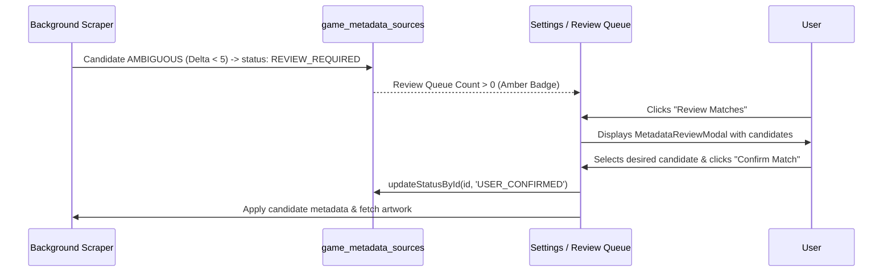

# Phase 5A: Identification & Candidate Matching Engine 🎯

## Overview

Accurate game identification from unstructured filenames, cloud paths, and ROM dump tags is critical to avoid false positives (e.g. matching "Gran Turismo 2" to "Gran Turismo 4", or matching a SNES ROM to a PS2 port).

Game Vault utilizes a multi-signal deterministic scoring engine to evaluate remote provider candidates against local game artifacts.

---

## 1. Game Identification Service (`GameIdentificationService.ts`)

Before querying any metadata provider, the file is analyzed to extract a structured `GameIdentityQuery`:

```typescript
export interface GameIdentityQuery {
  title: string;          // Raw title
  cleanTitle: string;     // Stripped of dump tags and extension
  platform?: GamePlatform;// Canonical platform
  serial?: string;        // SLUS-00594, SCUS-94163, etc.
  region?: string;        // NA, EU, JP, WORLD
  discNumber?: number;    // Disc 1, Disc 2, etc.
  fileHash?: string;      // CRC32, MD5, SHA1
  fileSize?: number;      // Exact byte size
}
```

### Tag Sanitization & Normalization
The service strips dump metadata enclosed in parentheses `(...)` or square brackets `[...]` while capturing their semantic signals:
- **Region Tags**: `(USA)`, `(Europe)`, `(Japan)`, `(World)`, `(En,Fr,De)` are mapped to canonical codes (`NA`, `EU`, `JP`, `WORLD`).
- **Disc Numbers**: `(Disc 1)`, `(Disc 2 of 3)`, `[CD2]` are parsed into numeric integers.
- **Console Serials**: Pattern matching recognizes PlayStation (`SLUS`, `SCUS`, `SLES`, `SCES`, `SLPS`), Nintendo DS (`NTR-`), PSP (`ULUS`, `ULES`), and Dreamcast product codes.

---

## 2. Deterministic Candidate Scorer (`MetadataCandidateScorer.ts`)

Each candidate returned by an external provider is evaluated against the `GameIdentityQuery`:

| Signal | Evaluation Method | Weight / Impact |
| :--- | :--- | :--- |
| **Title Similarity** | Normalized Levenshtein edit distance | Base score up to 60 points |
| **Platform Match** | Canonical platform equality check | **+20 points** bonus |
| **Platform Mismatch** | Candidate platform contradicts game platform | **-40 points** penalty |
| **Hardware Serial** | Candidate serial matches extracted serial | **+35 points** bonus |
| **Binary Hash** | SHA1/MD5 matches provider database | **Instant 100 points** |
| **Release Year** | Candidate year matches local manifest | **+10 points** bonus |
| **Region Match** | Candidate region matches query region | **+5 points** bonus |

### Confidence Tiers

Candidates are classified into 4 confidence tiers:
- **`EXACT`** ($\ge 95$): Perfect or near-perfect match (hash match, serial match, or exact title + platform).
- **`HIGH`** ($80 - 94$): Highly reliable match with matching platform and minor title variation.
- **`MEDIUM`** ($60 - 79$): Plausible candidate; recommended for verification.
- **`LOW`** ($< 60$): Poor correlation or cross-platform contradiction; rejected from automatic application.

---

## 3. Match Resolver & Ambiguity Detection (`MetadataMatchResolver.ts`)

Even high-scoring candidates must be checked for competitive ambiguity. If two candidates score similarly:

$$\Delta = |\text{Score}_{\text{top}} - \text{Score}_{\text{runner-up}}|$$

- **If $\Delta < 5$ points**: The engine classifies the result as **`AMBIGUOUS`**.
  - **Example**: Searching for "Final Fantasy" returns both "Final Fantasy Origins" (Score 88) and "Final Fantasy Anthology" (Score 86).
  - The pipeline does **NOT** guess. It routes the match to the **Review Queue** (`status = 'REVIEW_REQUIRED'`).
- **If $\Delta \ge 10$ points** and $\text{Score}_{\text{top}} \ge 80$: The match is accepted automatically.
- **If Single Candidate has $\text{Score} < 60$**: It requires manual user confirmation before applying.

---

## 4. Review Queue Workflow



The review queue ensures that Game Vault's library remains pristine, free of accidental misidentifications, while empowering the user to make the final determination with zero friction.
