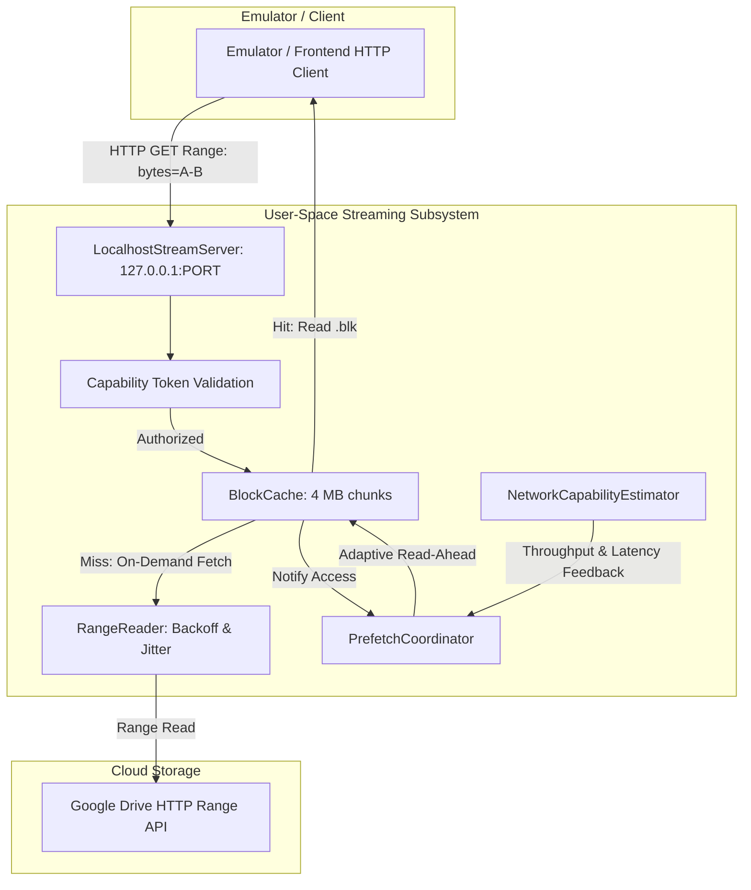

# Game Vault — Progressive ROM Streaming Engine (Phase 4C) 🌐

## 1. Architectural Overview

For medium-sized disc images (such as PS1 titles compressed as single-file `.chd` discs between 128 MB and 700 MB), downloading hundreds of megabytes before the title screen appears is unnecessary when the storage provider supports HTTP Range requests.

Game Vault introduces a **strictly user-space Progressive Streaming Architecture**:
- **Zero Kernel Drivers:** No WinFsp, Dokan, or virtual disk drivers that cause BSODs, require admin privileges, or fail antivirus audits.
- **Localhost HTTP Loopback Server:** Ephemeral HTTP server strictly bound to `127.0.0.1` serving standard `206 Partial Content` streams to emulators and frontends supporting HTTP/URI streams.
- **Sparse 4 MB Block Cache:** Divides ROM files into 4 MB blocks, stored as `.blk` files on disk with a companion `manifest.json`.
- **Adaptive Predictive Prefetching:** Monitors read streaks and proactively pulls sequential blocks ahead of emulator access.



---

## 2. Sparse Block Cache (`BlockCache.ts`)

### 2.1 4 MB Chunk Standard
Large ROMs are partitioned into logical 4 MB (4,194,304 bytes) blocks. For example, a 600 MB `.chd` disc contains 150 blocks indexed `0..149`.

### 2.2 Storage Layout
Streamed games are persisted in the cache directory:
```text
.gamevault/cache/streaming/<gameId>/
  ├── manifest.json
  └── blocks/
      ├── 0.blk
      ├── 1.blk
      ├── 2.blk
      └── 14.blk
```

### 2.3 Manifest Format (`manifest.json`)
```json
{
  "fileId": "gf_12345",
  "remoteFileId": "1a2b3c4d5e",
  "accountId": "acc_gdrive_main",
  "expectedSize": 629145600,
  "blockSize": 4194304,
  "blockCount": 150,
  "remoteVersion": "v1-2026-09-13",
  "cachedBlocks": [0, 1, 2, 14],
  "createdAt": "2026-09-13T12:00:00.000Z",
  "updatedAt": "2026-09-13T12:01:30.000Z"
}
```

### 2.4 In-Flight Deduplication
When multiple concurrent requests query the same block before the first request finishes over the network:
1. `inFlightRequests` Map checks if a `Promise<Buffer>` for `blockIndex` is already pending.
2. The subsequent requests join the existing in-flight Promise without issuing duplicate network calls to Google Drive.

### 2.5 Arbitrary Span Reads Across Block Boundaries
When an emulator requests bytes that span across block boundaries (e.g. from byte 4,194,200 to byte 4,194,400, crossing from Block 0 into Block 1):
`BlockCache.readRange(start, end)`:
1. Calculates `startBlock = Math.floor(start / 4MB)` and `endBlock = Math.floor(end / 4MB)`.
2. Asynchronously fetches each block.
3. Slices the exact required byte segments from each block buffer.
4. Concatenates and returns the contiguous byte array.

### 2.6 LRU Eviction & Block Locking
- **Active Block Protection:** In-flight blocks are locked via `lockBlock(blockIndex)` and cannot be evicted while active.
- **LRU Eviction:** If total cached blocks exceed `maxCacheBytes` (configurable in Settings), non-locked blocks are evicted in order of oldest file modification timestamp (`mtime`).
- **Cache Invalidation:** If remote file size or version header changes, all stored `.blk` files are purged and the manifest is reset.
- **Materialization:** Once all blocks are cached (`isFullyCached() === true`), `materializeFile(destinationPath)` stitches the contiguous monolithic file atomically on disk.

---

## 3. Adaptive Prefetch Coordinator (`PrefetchCoordinator.ts`)

To eliminate audio stuttering and game freezes during FMV playback, the `PrefetchCoordinator` dynamically adjusts its read-ahead window:

1. **Sequential Streak Detection:**
   - Every sequential block request (`blockIndex === lastRequestedBlock + 1`) increments the sequential streak counter.
   - For every 2 consecutive sequential hits, the read-ahead window expands by 1 block (up to `maxReadAheadBlocks`).
2. **Jump / Seek Reset:**
   - A non-sequential block jump (e.g. seeking to a new level or track) resets the streak and immediately reverts the read-ahead window to baseline (`baseReadAheadBlocks = 2`).
3. **Priority Inversion Prevention:**
   - Queue priorities:
     - `REQUESTED`: On-demand blocks required by the emulator right now (highest priority, head of queue).
     - `PREFETCH`: Predictive read-ahead blocks.
     - `BACKGROUND`: Full background hydration tasks.
4. **Network Adaptation:**
   - Dynamically throttles or expands concurrency based on network feedback from `NetworkCapabilityEstimator`.

---

## 4. Network Capability Estimator (`NetworkCapabilityEstimator.ts`)

Samples round-trip latency and transfer bandwidth across the last 20 requests:
- **`EXCELLENT`:** Bandwidth $> 10\text{ MB/s}$ and Latency $< 80\text{ ms}$.
- **`GOOD`:** Bandwidth $2\text{ MB/s} - 10\text{ MB/s}$ and Latency $< 250\text{ ms}$.
- **`FAIR`:** Bandwidth $500\text{ KB/s} - 2\text{ MB/s}$.
- **`POOR`:** Bandwidth $< 500\text{ KB/s}$ or Latency $> 600\text{ ms}$.

When network drops to `POOR`, progressive streaming automatically falls back to `LOCAL_REQUIRED` for non-started games, avoiding unplayable sessions.

---

## 5. Ephemeral Localhost Streaming Server (`LocalhostStreamServer.ts`)

- **Security: Strict Loopback:** Rejects all incoming requests whose `remoteAddress` is not `127.0.0.1`, `::1`, or `::ffff:127.0.0.1` with `403 Forbidden`.
- **Capability Tokens:** Server assigns a cryptographically random 128-bit hex session token (`crypto.randomBytes(16)`). Requests without the valid URL capability token are rejected with `403`.
- **Ephemeral Port:** Binds to OS-assigned port `0` (`127.0.0.1:0`) to avoid port collisions with other applications.
- **HTTP Range Handling:**
  - Responds to `HEAD` requests with `Accept-Ranges: bytes` and `Content-Length`.
  - Serves `Range: bytes=start-end` with `206 Partial Content`, `Content-Range: bytes start-end/totalSize`, and exact byte payload.
  - Returns `416 Range Not Satisfiable` if the requested range is out-of-bounds.
