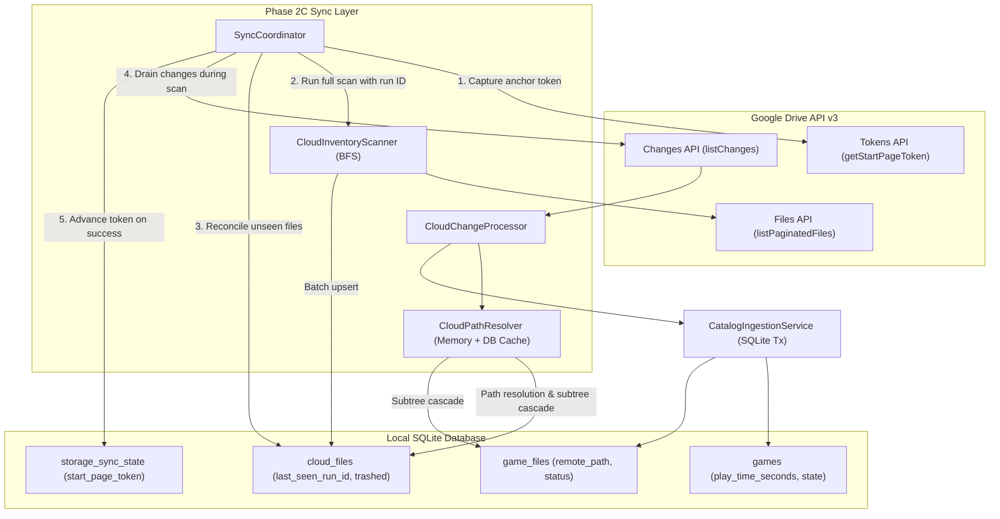

# Game Vault — Sync Correctness & Real-World Consistency Gate 🛡️

## 1. Overview & Architectural Motivation

In **Game Vault**, the remote storage is the source of truth for cloud game files, while the local SQLite database holds the user's unified catalog, play history, and cached assets. During the transition from initial scanning to incremental delta sync, edge cases inherent to cloud storage APIs (specifically Google Drive API v3) can cause catalog drift, ghost entries, duplicated games, lost play time, or broken path hierarchies if not handled rigorously.

Phase 2C establishes a production-hardened consistency gate that addresses all real-world sync edge cases:
- **Missing Paths in Delta Feeds:** The Google Drive `changes` endpoint omits path hierarchies and only returns the new `name` and updated `parents[]`.
- **Race Conditions During Initial Scans:** Cloud modifications occurring during a lengthy initial scan could be permanently missed or result in duplicate records if token anchoring is not ordered correctly.
- **Folder Rename and Move Cascades:** Moving or renaming a directory containing dozens of ROM files must instantly propagate through virtual paths in both `cloud_files` and `game_files` without waiting for a re-scan.
- **Token Invalidation & Expiration (HTTP 410 Gone):** Google Drive change tokens eventually expire or become invalid; recovery must trigger a safe, non-destructive full reconciliation.
- **Non-Destructive Deletions:** Remote deletions must never wipe user play history, ratings, custom cover art, or local cached binaries.
- **Status Terminology Alignment:** Strict separation between high-level game state (`GameState`) and individual file status (`GameFileStatus`).

---

## 2. Architecture & Component Interaction



---

## 3. Initial Sync Race Prevention Protocol

A major pitfall in cloud sync occurs when files are uploaded, deleted, or moved *while* a full initial scan is in progress. If the change token is captured *after* the scan completes, changes occurring during the scan are lost forever. Conversely, if captured before without draining, inconsistencies arise.

Game Vault implements a 6-step race prevention protocol:

1. **Pre-Scan Anchor Capture:** Before BFS directory traversal starts, `SyncCoordinator` queries Google Drive for `getStartPageToken()` and stores it in memory as `preScanStartToken`.
2. **Generation Marker Stamping:** A unique UUID `scanRunId` is generated. Every file indexed during the BFS scan is stamped with `lastSeenRunId = scanRunId` and `lastSeenAt = now()`.
3. **Scan Execution:** `CloudInventoryScanner` traverses the hierarchy.
4. **Conditional Unseen Reconciliation:**
   - **Only on 100% successful scan completion**, any previously registered file for that account where `last_seen_run_id != scanRunId` and `trashed = 0` is reconciled to `trashed = 1`.
   - **On cancellation or error**, reconciliation is strictly bypassed. Existing files are preserved as-is.
5. **In-Scan Delta Drain:** `SyncCoordinator` immediately queries `listChanges(preScanStartToken)`. Any changes that transpired during the BFS scan are processed through `CloudChangeProcessor`.
6. **Token Advancement & Flagging:** The latest token from the change list is saved to `storage_sync_state.start_page_token`, and `initial_scan_completed` is set to `1` in SQLite.

---

## 4. Virtual Path Resolution (`CloudPathResolver`)

### The Challenge
Google Drive `change` objects contain:
```json
{
  "fileId": "1a2b3c",
  "file": {
    "name": "Super Mario 64 (USA).z64",
    "mimeType": "application/octet-stream",
    "parents": ["folder-xyz"]
  }
}
```
The virtual path `/Emulation/N64/Super Mario 64 (USA).z64` is **not** provided by Google Drive.

### The Solution
`CloudPathResolver` provides fast, reliable path reconstruction:
1. **In-Memory Folder Path Cache:** Maintains an LRU cache mapping `(accountId, folderId) -> virtualPath`.
2. **Database Cache Lookup:** Queries SQLite `cloud_files` for `(storage_account_id, remote_file_id, is_folder = 1)`.
3. **Hierarchical Recursive Resolution:** If a parent folder is not in cache or DB, resolves up the ancestor chain.
4. **Fallback Remote Lookup:** If an ancestor is unknown locally, queries `provider.getFile(parentId)` to fetch its name and parents, storing all newly discovered folders in cache and DB.
5. **Root Resolution:** Any file located at the drive root or having no resolvable parent is assigned `/{filename}`.

---

## 5. Directory Rename & Move Handling (Subtree Cascade)

When a folder is moved (e.g., `/Roms/SNES` $\rightarrow$ `/Emulators/SNES`) or renamed (e.g., `/PlayStation` $\rightarrow$ `/PlayStation 1`):
1. Google Drive issues a single change event for the folder itself (new name or new parents).
2. `CloudPathResolver.handleFolderRenameOrMove()` calculates `oldFolderPath` and `newFolderPath`.
3. An atomic SQLite update updates the folder itself and all descendant files in `cloud_files`:
   ```sql
   UPDATE cloud_files
   SET remote_path = ? || SUBSTR(remote_path, ?),
       updated_at = ?
   WHERE storage_account_id = ?
     AND (remote_path = ? OR remote_path LIKE ? || '/%');
   ```
4. A parallel atomic update updates all catalog entries in `game_files`:
   ```sql
   UPDATE game_files
   SET remote_path = ? || SUBSTR(remote_path, ?),
       updated_at = ?
   WHERE storage_account_id = ?
     AND (remote_path = ? OR remote_path LIKE ? || '/%');
   ```
5. All affected game entities are re-evaluated for platform classification and display title consistency.

---

## 6. File Modification Lifecycle

### 6.1 Renaming or Moving a File
- If a file is renamed or moved to another folder, its `remote_path` and `filename` are updated in `cloud_files` and `game_files`.
- `FileClassifier` re-evaluates the file with its new path context.
- If the game title remains associated with the same slug, the file link is refreshed.
- If moved to a new game or platform, the catalog structure adapts gracefully.
- **User play history (`play_time_seconds`, `last_played_at`) is strictly preserved.**

### 6.2 Deleting or Trashing a File
- When Google Drive reports `removed = true` or `file.trashed = true`:
  - `cloud_files`: `trashed` set to `1`.
  - `game_files`: `status` set to `'MISSING'`.
  - `games`: Retained in the catalog. If all files belonging to a game are `MISSING`, the game displays a visual "Missing Cloud Files" indicator in the UI.
  - **No destructive deletion of the game record occurs.**

### 6.3 Restoring a File (Untrash)
- When a previously trashed or removed file reappears in changes (`trashed = false`):
  - `cloud_files`: `trashed` set to `0`.
  - `game_files`: `status` restored to `'REMOTE'` (or `'CACHED_LOCAL'` if local cache on disk is intact).
  - The game is immediately playable again.

---

## 7. Change Token Lifecycle & 410 Gone Recovery

```mermaid
sequenceDiagram
    participant SC as SyncCoordinator
    participant GDrive as Google Drive API
    participant DB as SQLite Database

    SC->>DB: Read start_page_token for account
    SC->>GDrive: listChanges(start_page_token)
    alt Token Valid
        GDrive-->>SC: Change list + newStartPageToken
        SC->>SC: Process changes (CloudChangeProcessor)
        alt Processing Succeeds
            SC->>DB: Save newStartPageToken
        else Processing Fails
            SC->>SC: Log error; DO NOT advance token
        end
    else Token Expired / Invalid (HTTP 410 Gone)
        GDrive-->>SC: Error 410 Gone / Invalid change token
        SC->>SC: Catch 410 error
        SC->>DB: Clear start_page_token
        SC->>SC: Initiate full resync recovery
        SC->>GDrive: getStartPageToken() [Anchor]
        SC->>GDrive: scanAccount() [Full BFS]
        SC->>DB: Reconcile unseen files & persist anchor token
    end
```

### Key Guarantees:
- **Token Only Advances on Success:** If processing fails at any point (e.g. database lock, disk failure), the token is not advanced. The subsequent sync run will retry the exact change batch.
- **Idempotency:** Applying the same change event multiple times produces the exact same SQLite state.
- **Automatic 410 Recovery:** If Google Drive purges the change history (e.g. account inactive for months), the application automatically falls back to a full BFS inventory scan, reconciles changes, and re-anchors the token without requiring user intervention.

---

## 8. State Consistency & Terminology

A key source of confusion in multi-tier launcher architectures is conflating game status with individual file status. Game Vault strictly enforces the following schema:

### `GameState` (`games.state`)
Represents the collective playability of the game as presented to the user:
- `CLOUD`: The game is discovered and cataloged, but binaries exist only on remote storage.
- `DOWNLOADING`: One or more files required to play the game are currently downloading.
- `READY`: All required binaries are downloaded and verified in the local cache, ready for execution.

### `GameFileStatus` (`game_files.status`)
Represents the local availability and lifecycle state of a specific file asset:
- `REMOTE`: File is available in remote cloud storage, but not cached locally. *(Note: NOT 'CLOUD')*
- `DOWNLOADING`: File is currently in the download queue / streaming.
- `CACHED_LOCAL`: File is fully downloaded, integrity verified, and available in the local cache.
- `MISSING`: File was deleted or moved to trash on remote cloud storage.

---

## 9. SQLite Transaction Boundaries

Catalog ingestion and change updates are wrapped inside SQLite transactions:
```typescript
db.transaction(() => {
  gamesRepo.upsert(game);
  for (const file of files) {
    gameFilesRepo.upsert(file);
  }
})();
```
If an unexpected error occurs during candidate resolution or file attachment:
- The entire transaction rolls back automatically.
- No orphan `games` records without `game_files` are created.
- No partial catalog ingestion leaves the database in an inconsistent state.

---

## 10. Test Matrix & Verification Summary

The Phase 2C test suite (`scripts/test-phase2c.ts`) provides automated coverage for 25 distinct scenarios:

| # | Test Scenario | Expected Outcome | Status |
| :--- | :--- | :--- | :---: |
| 1 | Folder rename updates child virtual paths in `cloud_files` | Child paths update atomically | PASS |
| 2 | Folder rename updates child virtual paths in `game_files` | Child paths update atomically | PASS |
| 3 | Folder move updates child virtual paths in `cloud_files` | Full subtree relocated | PASS |
| 4 | Folder move updates child virtual paths in `game_files` | Full subtree relocated | PASS |
| 5 | Deeply nested folder rename (3+ levels) | Deep paths updated correctly | PASS |
| 6 | File move updates `remote_path` without resetting metadata | Metadata & playtime preserved | PASS |
| 7 | File rename updates `filename` and `remote_path` | Attributes updated in DB | PASS |
| 8 | File deletion marks `cloud_files.trashed = 1` | Soft-deleted | PASS |
| 9 | File deletion transitions `game_files.status = 'MISSING'` | Status set to MISSING | PASS |
| 10 | File deletion preserves game in catalog | Game & play time retained | PASS |
| 11 | File restore transitions `game_files.status = 'REMOTE'` | Status restored to REMOTE | PASS |
| 12 | Initial scan anchors token before BFS traversal | Anchor token captured first | PASS |
| 13 | Initial scan drains changes occurring during scan | In-flight changes applied | PASS |
| 14 | Delta sync advances token only after successful processing | Token saved after commit | PASS |
| 15 | Delta sync does NOT advance token on processing failure | Token retained for retry | PASS |
| 16 | Duplicate change event processing is idempotent | No duplicate DB rows | PASS |
| 17 | Local ID stability across rename/move operations | ID unchanged | PASS |
| 18 | `firstSeenAt` remains unchanged across multiple syncs | Timestamp immutable | PASS |
| 19 | `lastSeenAt` updates on each observed change/scan | Timestamp refreshed | PASS |
| 20 | Cancelled full scan does NOT mark unseen files missing | Unseen files untouched | PASS |
| 21 | Failed full scan does NOT mark unseen files missing | Unseen files untouched | PASS |
| 22 | Successful full scan marks unseen files missing | Missing files trashed | PASS |
| 23 | HTTP 410 Gone triggers automatic safe full resync | Resync recovers catalog | PASS |
| 24 | Ingestion failure rolls back game and game_files | SQLite transaction rolls back | PASS |
| 25 | Multi-account changes remain completely isolated | Account data segregated | PASS |
| E2E | Section 18 End-to-End lifecycle (Full + Add + Rename + Move + Delete) | Zero duplication, clean sync | PASS |
